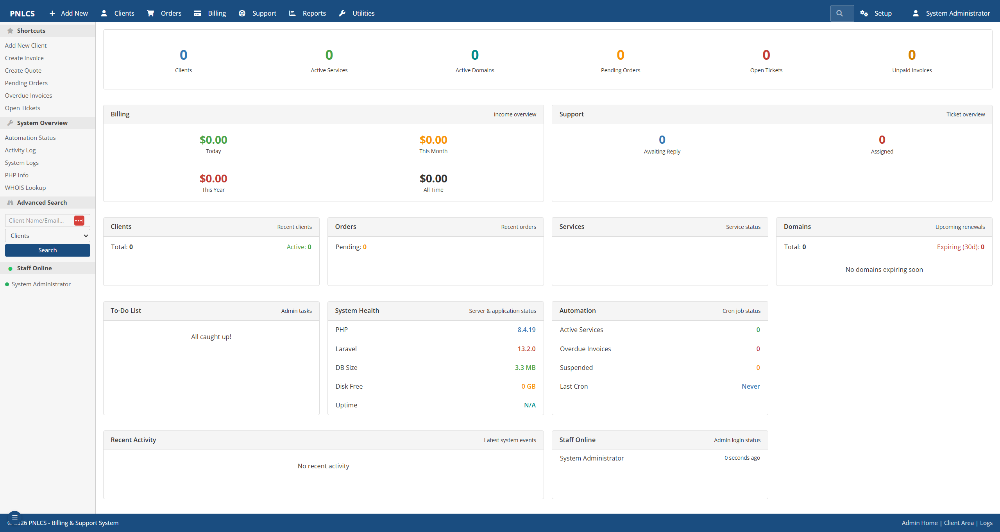
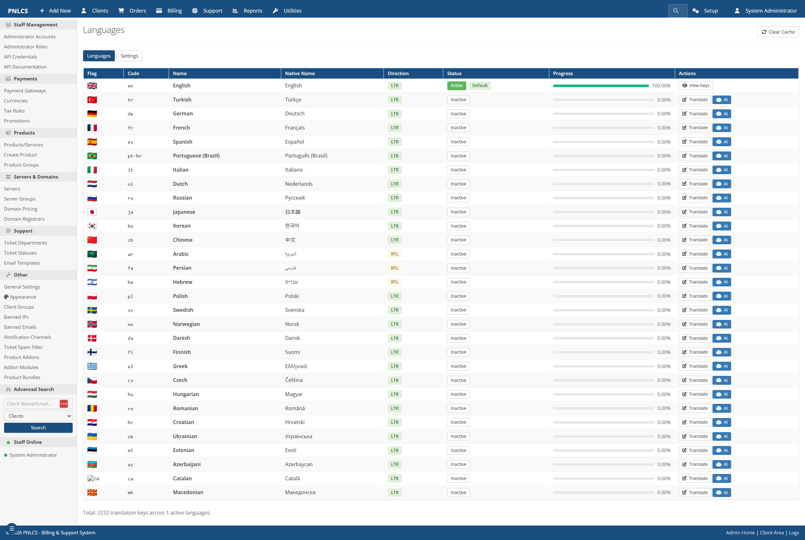
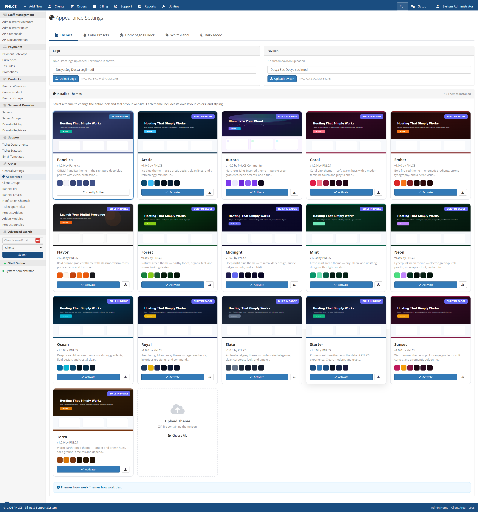
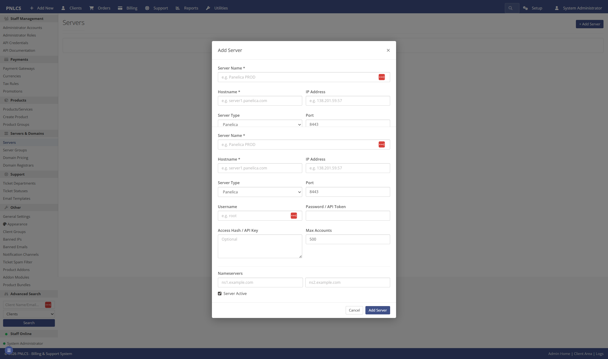
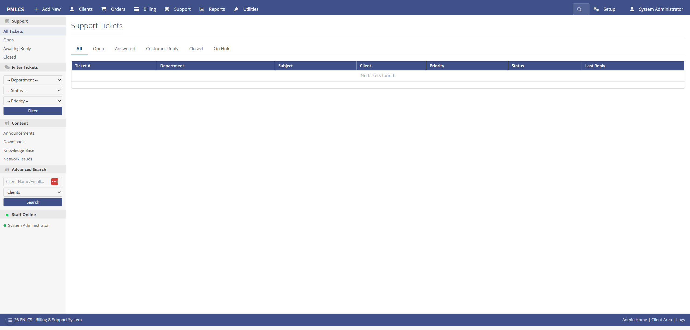
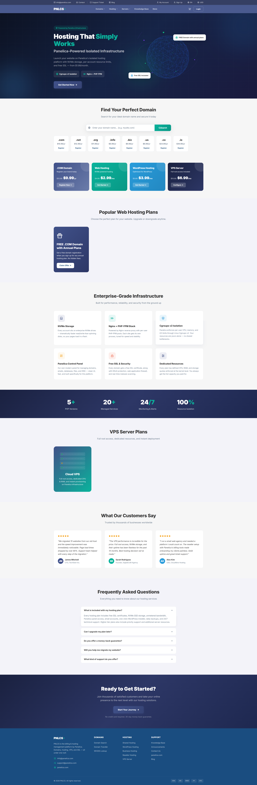
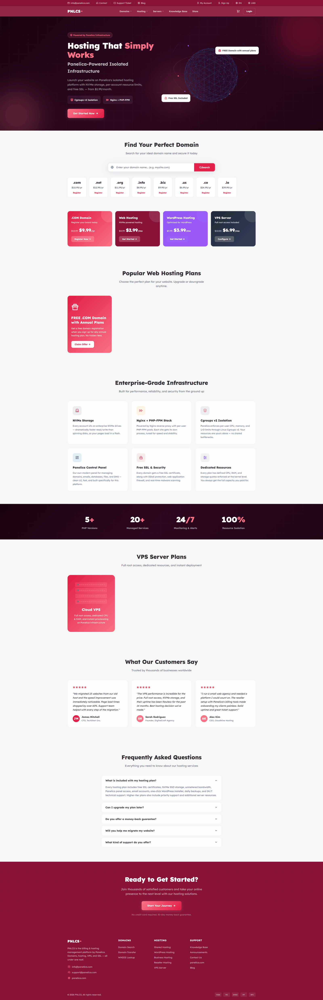

<h1 align="center">PNLCS</h1>

<p align="center">
  <b>Open-source, self-hosted hosting billing platform — a free WHMCS alternative.</b><br>
  Client portal · invoicing · domain &amp; SSL management · support tickets · reseller hosting.
</p>

<p align="center">
  Built with <b>Laravel 13</b> · <b>PHP 8.3+</b> · <b>MySQL 8</b> · <b>Alpine.js</b> · <b>Tailwind CSS 4</b>
</p>

<p align="center">
  <a href="https://github.com/Panelica/pnlcs/blob/main/LICENSE"></a>
  
  
  
  <a href="https://github.com/Panelica/pnlcs/stargazers"></a>
</p>

<p align="center">
  <a href="#installation">Installation</a> ·
  <a href="#first-steps-after-installation">First Steps</a> ·
  <a href="#screenshots">Screenshots</a> ·
  <a href="#features">Features</a> ·
  <a href="#modules">Modules</a> ·
  <a href="#contributing">Contributing</a>
</p>

---

## About — Open-Source WHMCS Alternative

**PNLCS** is a free, open-source, self-hosted **hosting billing platform**
and **client portal** — an open alternative to WHMCS for web hosting
companies, reseller hosts, and infrastructure providers. It covers the full
customer lifecycle: product catalog, checkout, recurring invoicing, domain
registration, SSL certificate management, support tickets, knowledge base,
and affiliate tracking.

If you have used WHMCS, you will feel at home: the data model, workflows,
and module ecosystem (servers, gateways, registrars, SSL providers) are
deliberately familiar. The difference is that PNLCS is **MIT-licensed**,
**self-hosted**, and free to fork, study, and extend.

This project is built and maintained by the **Panelica Server Management
Panel** team in our spare time, alongside our main product. We wanted an
open, self-hosted billing system that integrates natively with Panelica and
plays nicely with other control panels too — so we built one.

**What works well today:**

- Client portal, admin panel, and core billing flows
- Invoicing, orders, services, domains, tickets, knowledge base
- The **Panelica server module** (fully tested against live servers)
- Stripe payment gateway (tested in production)
- Multi-language UI (30 locales, admin-editable translations)

**What needs your help:**

- **cPanel / Plesk / DirectAdmin / Proxmox server modules** — code is in
  place but we have not tested them end-to-end. If you run one of these,
  please try it out and open an issue (or even better, a pull request)
  telling us what you found.
- **PayPal / Authorize.Net / Bank Transfer gateways** — same story.
- **Enom domain registrar** — API integration exists, needs real-world
  verification.
- General bug reports, typos, translation improvements.

We read every issue, but because this is a side project our response time
isn't always same-day. If you can include reproduction steps or a patch,
it helps us enormously.

---

## Screenshots — Admin Panel & Client Portal

### Admin Panel


*Admin dashboard with revenue, orders, and ticket overview*


*Built-in translation editor — 30 locales, 2,232 translation keys, AI-assisted bulk translate*


*WordPress-style theme system with 15 built-in themes, logo/favicon upload, dark mode toggle, and homepage builder*


*Server module management — connect Panelica, cPanel, Plesk, DirectAdmin, Proxmox, or custom servers*


*Ticket system with departments, priority routing, internal notes, and escalation rules*

### Client-Facing Site


*Customer-facing landing page with domain search, hosting plans, VPS servers, and FAQ — fully configurable*


*Same site with a different built-in theme applied — one click to switch*

---

## Hosting Billing Features

### 💼 Client Portal

- **Shop & checkout** — browse plans, configure service, apply coupons, pay
- **Service management** — upgrade, downgrade, cancel, auto-renew toggle
- **Domain management** — register, transfer, renew, EPP code, WHOIS
- **Invoicing** — view, pay online, download PDF, add-funds, credit balance
- **Support tickets** — attachments, priority, department routing
- **Knowledge base & announcements** — searchable, categorized
- **SSL certificates** — CSR generation, approver emails, auto-install
- **Affiliate program** — referral tracking, commission payouts
- **Account security** — 2FA (TOTP), login alerts, session history

### 🛡️ Admin Panel

- **Dashboard** — revenue, new signups, pending orders, open tickets at a glance
- **Client management** — profiles, impersonation, notes, billing summary
- **Orders & invoices** — manual create, bulk actions, mass mail, PDF export
- **Products & bundles** — configurable options, addons, pricing matrices
- **Ticket system** — internal notes, escalation rules, spam filter
- **Reports** — revenue, conversion funnel, MRR, churn, affiliate stats
- **Bulk operations** — mass email, bulk invoice, bulk service status update
- **Calendar** — events, reminders, scheduled tasks
- **Quotes & projects** — WHMCS-style pre-sales flow

### 🌐 Internationalization

- **30 locales**, English active by default
- **2,232 translation keys** for the core UI
- **In-browser editor** — edit strings without touching files
- **AI-assisted bulk translate** for missing keys
- **Export / import** JSON per locale

### 🎨 Theme System

- **15 built-in themes** (Arctic, Aurora, Coral, Ember, Forest, Midnight,
  Mint, Neon, Ocean, Panelica, Royal, Slate, Starter, Sunset, and more)
- **WordPress-style** install / activate / delete workflow
- **Homepage builder** with reorderable sections
- **Per-site white-label** options (logo, favicon, footer copyright)
- **Dark mode** toggle per theme

### 🔐 Security & Access Control

- **RBAC** with over 45 fine-grained permissions
- **2FA (TOTP)** for both admin and client portals
- **Rate-limited** login, 2FA verify, password reset, email resend
- **IP whitelisting** for admin area (optional)
- **Session timeout** and **force logout** support
- **Activity log** — every admin action recorded
- **Banned IPs & emails** at the application level

### 💳 Billing & Automation

- **Recurring billing** — monthly, quarterly, semi-annually, annually, biennially
- **Auto-suspend** unpaid services after configurable grace period
- **Late fees**, promotions, coupons, tax rules (inclusive/exclusive)
- **Overage billing** — disk / bandwidth metering, opt-in per product
- **Credit balances** & add-funds flow
- **Automated reminders** — invoice, payment, CC expiry, domain renewal
- **Auto-renew** services and domains with billing integration

### ⚙️ Developer Features

- **REST API** with API-key auth for external integrations
- **Webhooks** — inbound (gateway callbacks) and outbound (events)
- **Queue workers** for email and background jobs
- **Scheduled commands** — invoice generation, reminders, polling
- **Modular architecture** — add server / gateway / registrar modules
  without touching core
- **Eloquent everywhere** — no raw SQL, no string concatenation

---

## Requirements

| Component | Minimum |
|-----------|---------|
| PHP       | 8.3 or 8.4 |
| MySQL     | 8.0 (or MariaDB 10.6) |
| Node.js   | 18+ |
| Composer  | 2.x |
| Web server | Nginx or Apache with PHP-FPM |
| PHP extensions | `bcmath`, `curl`, `dom`, `fileinfo`, `gd`, `mbstring`, `mysqli`, `openssl`, `pdo_mysql`, `tokenizer`, `xml`, `zip` |

**Optional but recommended:** Redis (session/cache), SMTP server or relay
(email delivery), supervisor (queue worker).

---

## Self-Hosted Installation

### 1. Clone the repository

```bash
git clone https://github.com/Panelica/pnlcs.git
cd pnlcs
```

### 2. Install PHP dependencies

```bash
composer install --no-dev --optimize-autoloader
```

### 3. Create the database

```sql
CREATE DATABASE pnlcs CHARACTER SET utf8mb4 COLLATE utf8mb4_unicode_ci;
CREATE USER 'pnlcs'@'localhost' IDENTIFIED BY 'choose-a-strong-password';
GRANT ALL PRIVILEGES ON pnlcs.* TO 'pnlcs'@'localhost';
FLUSH PRIVILEGES;
```

### 4. Configure environment

```bash
cp .env.example .env
```

Open `.env` in your editor and set at least these values:

```ini
APP_NAME="Your Company"
APP_URL=https://billing.your-domain.com
APP_ENV=production
APP_DEBUG=false

DB_DATABASE=pnlcs
DB_USERNAME=pnlcs
DB_PASSWORD=choose-a-strong-password

MAIL_FROM_ADDRESS="noreply@your-domain.com"
MAIL_FROM_NAME="Your Company"
```

**Note:** `DB_CONNECTION` defaults to `mysql` — do not change it to `sqlite`
unless you know what you're doing (some migrations use MySQL-specific SQL).

### 5. Generate the application key

```bash
php artisan key:generate
```

### 6. Run migrations and seed default data

```bash
php artisan migrate --force
php artisan db:seed --force
```

The seeder creates:

- A default admin account: **`admin` / `admin123`** (change this immediately
  after your first login)
- Four starter currencies (USD, EUR, GBP, TRY)
- Ticket departments, statuses, email templates
- 30 language entries (English active by default)
- 2,232 English translation keys
- Default homepage sections and domain pricing rows

### 7. Build frontend assets

```bash
npm install
npm run build
```

### 8. Create the public storage symlink

```bash
php artisan storage:link
```

### 9. Cache configuration for production

```bash
php artisan optimize
```

### 10. Set directory permissions

```bash
chmod -R 775 storage bootstrap/cache
chown -R www-data:www-data storage bootstrap/cache
```

*(adjust the user to match your server — `nginx`, `apache`, or your panel user)*

### 11. Point your web server to `public/`

Whatever you use — a control panel, raw Nginx, Apache, Caddy — make sure
**the document root is the `public/` directory**, not the project root.

### 12. Schedule the cron runner

Add a single line to the web user's crontab (`crontab -e`):

```
* * * * * cd /path/to/pnlcs && php artisan schedule:run >> /dev/null 2>&1
```

This drives invoice generation, payment reminders, automatic suspensions,
SSL polling, and other background tasks.

### 13. Run a queue worker (optional but recommended)

Email delivery and background jobs run through the queue. A simple
`supervisor` entry:

```ini
[program:pnlcs-worker]
command=php /path/to/pnlcs/artisan queue:work database --sleep=3 --tries=3 --max-time=3600
autostart=true
autorestart=true
user=www-data
```

---

## First Steps After Installation

Once the site loads and you can reach `/admin/login`, do these in order:

### 1. Sign in and change the admin password

- URL: `https://billing.your-domain.com/admin/login`
- Username: **`admin`**
- Password: **`admin123`**
- Immediately open **My Account → Change Password** and set a strong password.
- (Recommended) Enable **Two-Factor Authentication** from the same screen.

### 2. Configure General Settings

**Settings → General**

- Company name, support email, logo, favicon
- Default language, currency, timezone
- Date format, invoice pay terms, tax behavior

### 3. Configure Email Delivery

**Settings → Email** (or edit `.env` directly)

- Set `MAIL_MAILER` to `smtp` (default is `log` for testing)
- Fill in `MAIL_HOST`, `MAIL_PORT`, `MAIL_USERNAME`, `MAIL_PASSWORD`
- Send a **test email** from the settings page to verify

Until this is done, emails are written to `storage/logs/laravel.log` only.

### 4. Customize Appearance

**Settings → Appearance**

- Pick a theme from the 15 built-in options
- Upload your logo and favicon
- Configure homepage sections (hero, features, pricing, testimonials)
- Set up white-label footer text

### 5. Add Payment Gateways

**Configuration → Gateways**

- **Stripe** — paste your API keys, enable
- **PayPal** — client ID + secret (sandbox or live)
- **Bank Transfer** — set instructions shown to clients
- Test each gateway with a small order before going live

### 6. Add Server Modules (if you sell hosting)

**Configuration → Servers**

- Add your Panelica / cPanel / Plesk / DirectAdmin server
- Test the API connection from the server edit page
- Assign servers to **server groups** if you have multiple

### 7. Create Your First Product

**Products** (main admin menu)

- Create a **product group** (e.g. "Shared Hosting")
- Create a product, link it to a server and a module
- Set pricing for monthly / quarterly / annually
- Enable **auto-setup** if you want provisioning on payment

### 8. Configure Domain Pricing (if you sell domains)

**Configuration → Domain Pricing**

- Add TLDs you sell (`.com`, `.net`, ...)
- Set registration, transfer, and renewal prices
- Link to a registrar module (or use Manual)

### 9. Set Up Tax Rules

**Configuration → Tax**

- Add country-level or state-level tax rules
- Choose inclusive or exclusive tax display
- Assign taxable flag to products individually

### 10. (Optional) Invite Staff and Define Roles

**Configuration → Admin Roles / Admins**

- Create custom roles (e.g. "Billing Manager", "Support Agent")
- Pick permissions per role from the 45+ available
- Add staff members and assign roles

### 11. Enable Email Verification for Signups (recommended)

**Settings → General → Security**

- Toggle **Require email verification** on
- New signups will receive a verification link before they can order

### 12. Test the Full Flow End-to-End

- Open an **incognito browser**
- Visit `/client/register` and create a test client
- Place a test order for one of your products
- Pay with the test mode of your gateway
- Verify the invoice, service, and email flow all work

---

## Upgrading

```bash
git pull
composer install --no-dev --optimize-autoloader
php artisan migrate --force
npm install
npm run build
php artisan optimize:clear
php artisan optimize
```

Always back up your database before pulling new migrations.

---

## Modules — Servers, Payment Gateways & Domain Registrars

PNLCS ships with modular **server**, **gateway**, **registrar**, and **SSL
provider** integrations under the `modules/` directory. Add control-panel
servers (cPanel, Plesk, DirectAdmin, Proxmox, Panelica), configure
payment gateways (Stripe, PayPal, bank transfer), and connect domain
registrars (Enom) without touching core code.

| Module        | Type      | Status            |
|---------------|-----------|-------------------|
| Panelica      | Server    | ✅ Tested         |
| cPanel        | Server    | ⚠️ Needs testing  |
| Plesk         | Server    | ⚠️ Needs testing  |
| DirectAdmin   | Server    | ⚠️ Needs testing  |
| Proxmox       | Server    | ⚠️ Needs testing  |
| Custom        | Server    | ⚠️ Needs testing  |
| Stripe        | Gateway   | ✅ Tested         |
| PayPal        | Gateway   | ⚠️ Needs testing  |
| Authorize.Net | Gateway   | ⚠️ Needs testing  |
| BankTransfer  | Gateway   | ⚠️ Needs testing  |
| Enom          | Registrar | ⚠️ Needs testing  |
| Manual        | Registrar | ✅ Works          |
| GoGetSSL      | SSL       | ⚠️ Needs testing  |
| Sectigo       | SSL       | ⚠️ Needs testing  |
| Manual        | SSL       | ✅ Works          |

If you run one of the "needs testing" integrations in production, please
open an issue with what worked and what didn't. A short note is enough —
we can iterate from there.

Adding a new module? Look at the existing ones as a reference; each module
is a self-contained directory with a handler class and optional config view.

---

## Internationalization

All UI strings live in the database (`dynamic_translations` table) and
flat PHP files under `lang/<locale>/`. Translations are editable from the
admin panel under **Configuration → Languages & Translations**. Exporting
to JSON, importing, and AI-assisted batch translation are supported out
of the box.

If your language isn't covered yet, you can either submit a PR against
the seeder or use the admin UI's export/import flow.

---

## Security

- All admin routes require authentication via the `admin.auth` middleware
- Over 250 admin endpoints are gated by fine-grained permissions
- CSRF protection on every form
- Rate limiting on login, 2FA, password reset, and verification email resends
- Webhook routes are CSRF-exempt but validated by HMAC signatures
- Eloquent ORM everywhere (no raw SQL concatenation)

Please report security issues privately to **security@panelica.com** rather
than opening a public GitHub issue.

---

## Contributing

Issues and pull requests are welcome.

Ways to help:

1. **Test a module** from the "Needs testing" list above and file an issue
   with what you found.
2. **Report a bug** with reproduction steps — screenshots help a lot.
3. **Improve a translation** via the admin UI's export, edit a JSON file,
   and send us a PR.
4. **Write documentation** — installation on specific hosting panels, how
   to add a custom module, etc.

Please keep in mind:

- This is a side project for the Panelica team. We'll get to issues as
  quickly as we can but same-day responses are rare.
- PRs that include tests are prioritized.
- Please match the existing coding style (Laravel Pint + conventional
  commits).

---

## Support & Community

Need help, want to report a bug, or have a feature request?

- 🐛 **Bug reports & feature requests** — [GitHub Issues](https://github.com/Panelica/pnlcs/issues)
- 💬 **Community forum** — [forum.panelica.com](https://forum.panelica.com)
- 📧 **Email** — [info@panelica.com](mailto:info@panelica.com)
- 🌐 **Main site** — [panelica.com](https://panelica.com)
- 🔒 **Security disclosures** — [security@panelica.com](mailto:security@panelica.com) *(please do not open public issues for security)*

We're happy to help from the forum or by email, but since this is a side
project your patience is appreciated. For urgent matters, the forum tends
to get the fastest community response.

---

## Credits

- **Panelica Server Management Panel** team — initial development and
  ongoing maintenance
- **Laravel** by Taylor Otwell and the Laravel community
- **WHMCS** — for inspiring much of the data model and workflow
- Every contributor who opens an issue or a pull request

---

## License

Released under the **MIT License**. See [`LICENSE`](LICENSE) for details.

---

<p align="center">
  <sub>
    <b>Keywords:</b> WHMCS alternative · open-source hosting billing · self-hosted
    billing platform · Laravel billing · PHP client portal · hosting management
    software · free WHMCS · invoicing system · reseller hosting software ·
    domain management · SSL management · support ticket system · hosting CRM
  </sub>
</p>
