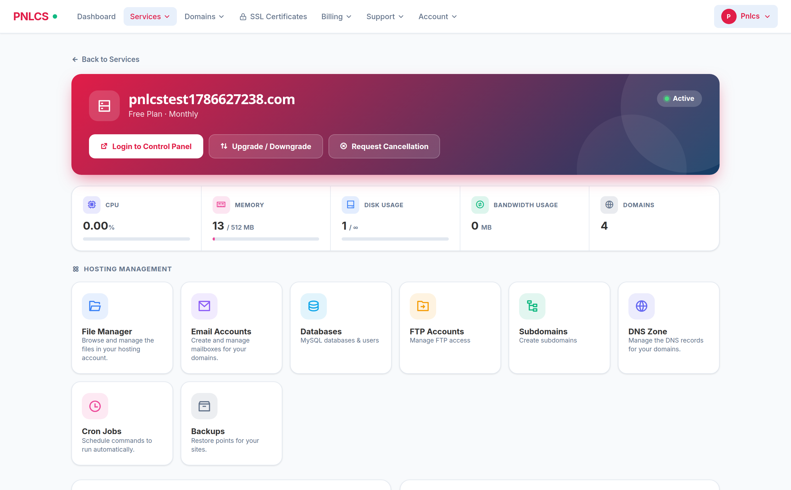
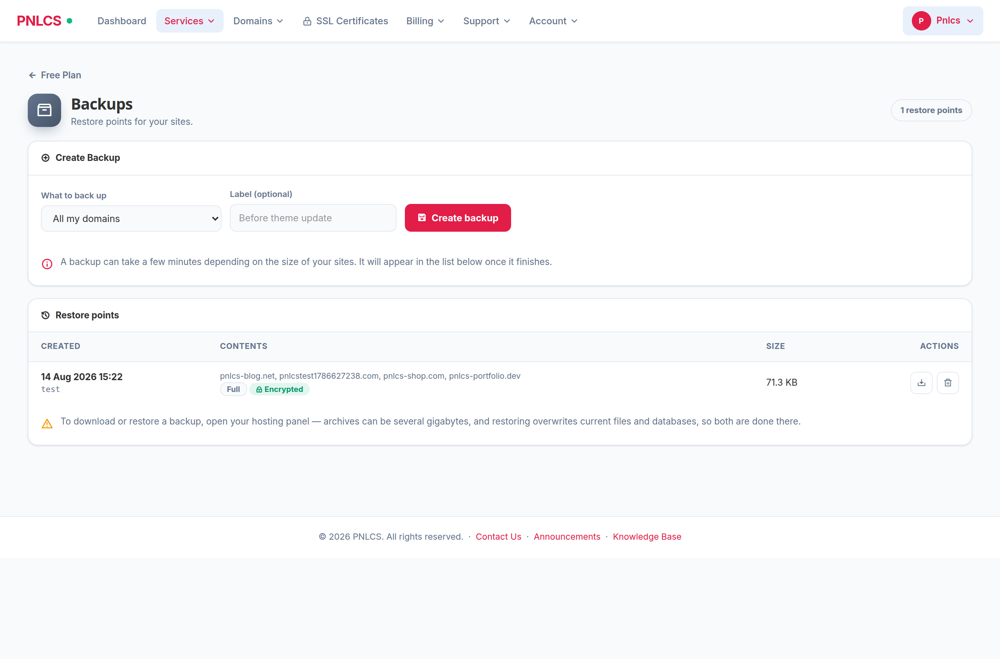
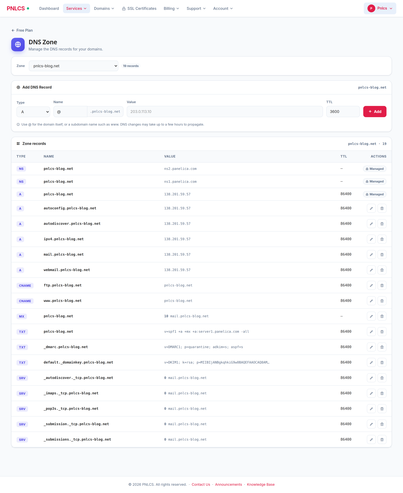
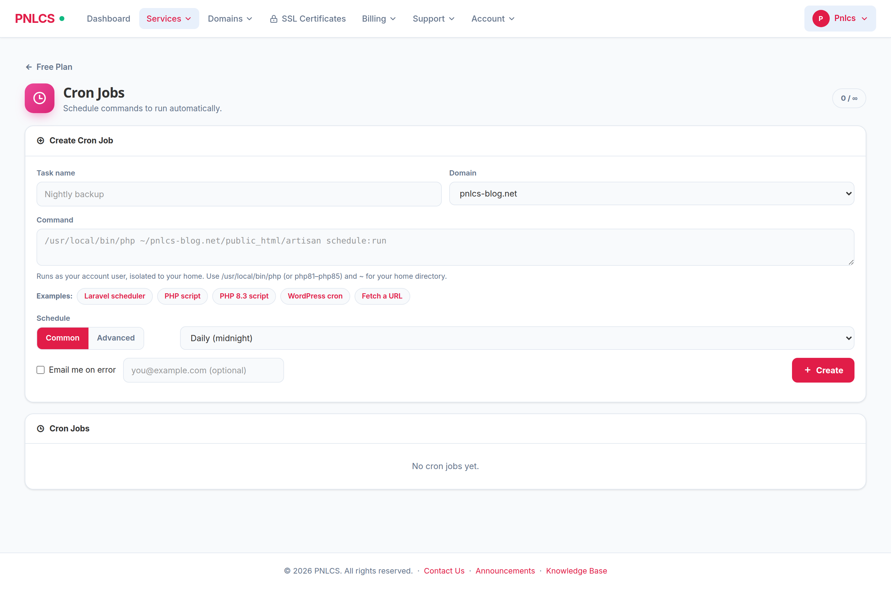

<p align="center">
  <a href="https://pnlcs.com/"><b>pnlcs.com</b></a>
</p>

<h1 align="center">PNLCS</h1>

<p align="center">
  <b>Open-source, self-hosted hosting billing platform — a free WHMCS alternative.</b><br>
  Client portal · invoicing · domain &amp; SSL management · support tickets · reseller hosting.<br>
  <b>Customers manage their hosting from the billing portal itself</b> — files, mail,
  databases, FTP, subdomains, DNS, cron and backups.
</p>

<p align="center">
  Built with <b>Laravel 13</b> · <b>PHP 8.4+</b> · <b>MySQL 8</b> · <b>Alpine.js</b> · <b>Tailwind CSS 4</b>
</p>

<p align="center">
  <a href="https://github.com/Panelica/pnlcs/blob/main/LICENSE"></a>
  
  
  
  <a href="https://github.com/Panelica/pnlcs/stargazers"></a>
</p>

<p align="center">
  <a href="https://pnlcs.com/"></a>
  <a href="https://hosting.panelica.com/"></a>
</p>

<p align="center">
  <b>👉 Try the live demo: <a href="https://hosting.panelica.com/">hosting.panelica.com</a></b>
</p>

<p align="center">
  <a href="https://pnlcs.com/"><b>Website</b></a> ·
  <a href="https://hosting.panelica.com/"><b>Live Demo</b></a> ·
  <a href="https://panelica.github.io/pnlcs/">Documentation</a> ·
  <a href="#quick-start-with-docker">Docker</a> ·
  <a href="#installation">Installation</a> ·
  <a href="#first-steps-after-installation">First Steps</a> ·
  <a href="#screenshots">Screenshots</a> ·
  <a href="#features">Features</a> ·
  <a href="#modules">Modules</a> ·
  <a href="#contributing">Contributing</a>
</p>

<p align="center">
  <a href="https://hub.docker.com/r/panelica/pnlcs-runtime"></a>
  <a href="https://hub.docker.com/r/panelica/pnlcs-runtime"></a>
</p>

---

## About — Open-Source WHMCS Alternative

**PNLCS** is a free, open-source, self-hosted **hosting billing platform**
and **client portal** — an open alternative to WHMCS for web hosting
companies, reseller hosts, and infrastructure providers. It covers the full
customer lifecycle: product catalog, checkout, recurring invoicing, domain
registration, SSL certificate management, support tickets, knowledge base,
and affiliate tracking.

If you have used WHMCS, you will feel at home: the data model, workflows,
and module ecosystem (servers, gateways, registrars, SSL providers) are
deliberately familiar. The difference is that PNLCS is **MIT-licensed**,
**self-hosted**, and free to fork, study, and extend.

This project is built and maintained by the **Panelica Server Management
Panel** team in our spare time, alongside our main product. We wanted an
open, self-hosted billing system that integrates natively with Panelica and
plays nicely with other control panels too — so we built one.

**What works well today:**

- Client portal, admin panel, and core billing flows
- Invoicing, orders, services, domains, tickets, knowledge base
- The **Panelica server module** (fully tested against live servers)
- Stripe payment gateway (tested in production)
- Multi-language UI (30 locales, admin-editable translations)

**What needs your help:**

- **cPanel / Plesk / DirectAdmin / Proxmox server modules** — code is in
  place but we have not tested them end-to-end. If you run one of these,
  please try it out and open an issue (or even better, a pull request)
  telling us what you found.
- **PayPal / Authorize.Net / Bank Transfer gateways** — same story.
- **Enom domain registrar** — API integration exists, needs real-world
  verification.
- General bug reports, typos, translation improvements.

We read every issue, but because this is a side project our response time
isn't always same-day. If you can include reproduction steps or a patch,
it helps us enormously.

---

## Built for Panelica — The Modern Hosting Control Panel

PNLCS is developed and maintained by the team behind
**[Panelica](https://panelica.com)**, a modern server management panel for web
hosting — a fresh alternative to cPanel, Plesk, and CyberPanel.

**Why Panelica?**

- **No CloudLinux required.** Per-user isolation — CPU, RAM, I/O, and process
  limits — is built in natively via cgroups v2, Linux namespaces, per-user
  PHP-FPM pools, and SSH chroot. You get CageFS/LVE-style tenant isolation
  without paying for a separate CloudLinux license.
- **Universal migration.** Move whole accounts in from cPanel, Plesk,
  DirectAdmin, and CyberPanel — sites, databases, emails, DNS, and SSL — with
  file and database hashes preserved, so passwords and configs keep working.
- **Affordable.** A modern, fully isolated hosting stack at a fraction of the
  typical cPanel + CloudLinux bill.
- **All-in-one, isolated stack.** Nginx, Apache, multiple PHP versions,
  PostgreSQL, MySQL, Redis, BIND, mail (Postfix/Dovecot), FTP, ClamAV,
  fail2ban, and ModSecurity — each service isolated and managed from one panel.

PNLCS integrates natively with Panelica through the built-in **Panelica server
module**: sell hosting plans and accounts are provisioned on your Panelica
servers automatically — and the customer then manages that hosting (files,
mailboxes, databases, FTP, subdomains, DNS, cron, backups) **from the billing
portal itself**, with every action fenced to their own account. See
[Hosting Management from Inside Billing](#hosting-management-from-inside-billing).

**Not only Panelica.** PNLCS is control-panel agnostic — you can connect and
provision on **cPanel, Plesk, DirectAdmin, HestiaCP, Proxmox, and Vultr** too,
right alongside your Panelica servers. Mix and match panels in a single install;
Panelica is simply where PNLCS feels most at home.

👉 **Learn more at [panelica.com](https://panelica.com)**

---

## Screenshots — Admin Panel & Client Portal

### Admin Panel


*Admin dashboard with revenue, orders, and ticket overview*


*Built-in translation editor — 30 locales, 2,232 translation keys, AI-assisted bulk translate*


*WordPress-style theme system with 15 built-in themes, logo/favicon upload, dark mode toggle, and homepage builder*


*Server module management — connect Panelica, cPanel, Plesk, DirectAdmin, Proxmox, or custom servers*


*Ticket system with departments, priority routing, internal notes, and escalation rules*

### Client-Facing Site


*Customer-facing landing page with domain search, hosting plans, VPS servers, and FAQ — fully configurable*


*Same site with a different built-in theme applied — one click to switch*


*The app showcase: 98 applications a customer can install into their hosting,
with the logos shipped in the repository. Heading, copy, button and how many
apps to show are all editable from the admin Homepage screen*

### Client Portal — Hosting Management


*A customer's hosting service: live resource usage from the server and eight
working tools — files, mail, databases, FTP, subdomains, DNS, cron, backups.
[Full detail below](#hosting-management-from-inside-billing)*


*Restore points with size, contents and encryption state — fenced to the
customer's own domains*


*Installing an app from the customer's own control panel: searchable, grouped
the way people shop, and every card states the memory the app needs and how
many containers it starts. An app that wants more than the plan allows is
marked before it is chosen, not after it fails*

---

## Hosting Billing Features

### 💼 Client Portal

- **Shop & checkout** — browse plans, configure service, apply coupons, pay
- **Service management** — upgrade, downgrade, cancel, auto-renew toggle
- **Domain management** — register, transfer, renew, EPP code, WHOIS
- **Invoicing** — view, pay online, download PDF, add-funds, credit balance
- **Quotes** — review, accept (auto-converts to invoice) or decline pre-sales quotes
- **Payment methods** — save bank-transfer references, set a default
- **Bank-transfer notifications** — report an offline payment with receipt upload
- **Email history** — read every email the system has sent you
- **Network status** — live view of active incidents and scheduled maintenance
- **Support tickets** — attachments, priority, department routing
- **Knowledge base & announcements** — searchable, categorized
- **SSL certificates** — CSR generation, approver emails, auto-install
- **Affiliate program** — referral tracking, commission payouts
- **Account security** — 2FA (TOTP), login alerts, session history
- **Hosting management** — files, mailboxes, databases, FTP, subdomains,
  cron, DNS and backups, without leaving billing ([details below](#hosting-management-from-inside-billing))

### 🛡️ Admin Panel

- **Dashboard** — revenue, new signups, pending orders, open tickets at a glance
- **Client management** — profiles, impersonation, notes, billing summary
- **Orders & invoices** — manual create, bulk actions, mass mail, PDF export
- **Products & bundles** — configurable options, addons, pricing matrices
- **Ticket system** — internal notes, escalation rules, spam filter
- **Reports** — revenue, conversion funnel, MRR, churn, affiliate stats
- **Bulk operations** — mass email, bulk invoice, bulk service status update
- **Calendar** — events, reminders, scheduled tasks
- **Quotes & projects** — WHMCS-style pre-sales flow

### 🌐 Internationalization

- **30 locales**, English active by default
- **2,232 translation keys** for the core UI
- **In-browser editor** — edit strings without touching files
- **AI-assisted bulk translate** for missing keys
- **Export / import** JSON per locale

### 🎨 Theme System

- **15 built-in themes** (Arctic, Aurora, Coral, Ember, Forest, Midnight,
  Mint, Neon, Ocean, Panelica, Royal, Slate, Starter, Sunset, and more)
- **WordPress-style** install / activate / delete workflow
- **Homepage builder** with reorderable sections
- **Per-site white-label** options (logo, favicon, footer copyright)
- **Dark mode** toggle per theme

### 🔐 Security & Access Control

- **RBAC** with over 45 fine-grained permissions
- **2FA (TOTP)** for both admin and client portals
- **Rate-limited** login, 2FA verify, password reset, email resend
- **IP whitelisting** for admin area (optional)
- **Session timeout** and **force logout** support
- **Activity log** — every admin action recorded
- **Banned IPs & emails** at the application level

### 💳 Billing & Automation

- **Recurring billing** — monthly, quarterly, semi-annually, annually, biennially
- **Auto-suspend** unpaid services after configurable grace period
- **Late fees**, promotions, coupons, tax rules (inclusive/exclusive)
- **Overage billing** — disk / bandwidth metering, opt-in per product
- **Credit balances** & add-funds flow
- **Automated reminders** — invoice, payment, CC expiry, domain renewal
- **Auto-renew** services and domains with billing integration
- **Unified payment engine** — one path for gateways, manual and credit, with partial-payment and overpayment-to-credit handling
- **Reliable provisioning** — a service only activates after the server module succeeds; failures are queued and retried automatically with admin alerts
- **Refunds** — reverse a payment via the gateway API (or offline), full or partial
- **Exchange-rate auto-update**, **automated database backups**, and **log retention** on a schedule

### ⚙️ Developer Features

- **REST API** with API-key auth for external integrations
- **Webhooks** — inbound (gateway callbacks) and outbound (events)
- **Queue workers** for email and background jobs
- **Scheduled commands** — invoice generation, reminders, polling
- **Hook system** — WHMCS-compatible `add_hook()` / `run_hook()` with 20+ hook points; a failing hook can never break billing or provisioning
- **Email piping** — inbound IMAP/POP3 mailboxes turn emails into tickets and replies
- **Modular architecture** — add server / gateway / registrar modules
  without touching core
- **Eloquent everywhere** — no raw SQL, no string concatenation

---

## Hosting Management from Inside Billing

Most billing platforms stop at "here is your control panel password." PNLCS
does the day-to-day hosting work **in the billing portal itself**, so a customer
who wants to add a mailbox or a DNS record never has to learn a second interface.


*A hosting service in the client portal — live CPU/memory/disk/bandwidth from the
server, and eight working tools underneath*

Available on services provisioned through the **Panelica server module**
(the module tells the portal which tools that account may use):

| Tool | What the customer can do |
|------|--------------------------|
| **File Manager** | Browse, upload, download, edit, rename, create folders and delete |
| **Email Accounts** | Create and delete mailboxes, change passwords, open webmail |
| **Databases** | Create MySQL databases and users, reset user passwords, open phpMyAdmin |
| **FTP Accounts** | Create accounts, change passwords, delete — with host/port shown |
| **Subdomains** | Create and remove subdomains; the panel provisions the real vhost, document root, PHP-FPM pool, SSL and DNS |
| **DNS Zone** | Add, edit and delete A / AAAA / CNAME / MX / TXT / SRV / CAA records |
| **Cron Jobs** | Schedule commands, run one immediately and read its output, pause/resume, delete |
| **Backups** | Take restore points, see size and contents, delete old ones |

### Everything is fenced to the customer's own account

The server API key a billing platform holds is operator-wide — it can see every
account on the box. That is exactly the mistake this integration does not make:
**every list is filtered against the domains that belong to the service being
viewed**, and every write is checked the same way before it is sent.

- A backup archive that also covers somebody else's domain is not shown, and
  cannot be deleted.
- A cron job, subdomain or DNS record on a foreign domain is rejected before a
  request leaves the billing server.
- Plan limits are read from the customer's hosting plan — `max_subdomains`,
  `max_cron_jobs`, `cron_jobs_enabled`, `backup_enabled` — and the create form
  is gated on them (the panel enforces them again, independently).

### The records that keep a site online stay read-only


*One zone at a time, records ordered the way an operator reads them, and the
delegation and apex records locked*

A zone editor in a billing panel is a fast way for a customer to take their own
site offline. So the records the hosting itself depends on — `SOA`, `NS`, and the
apex/`www` `A` records pointing at the server — are shown as **Managed** and
cannot be edited, renamed into, or deleted here. Renaming an ordinary record
*into* one of those names is blocked too. The hosting panel remains the place to
override that deliberately.

The same restraint applies elsewhere: **restoring** a backup is not offered in
billing (it silently discards everything written since the archive was taken),
and cron commands run as the account's own unprivileged system user inside the
panel's namespace and cgroup isolation — never as root.


*Common schedules or a full five-field expression, with example commands that
fill in the customer's real domain path*

---

## Requirements

| Component | Minimum |
|-----------|---------|
| PHP       | **8.4** (the locked Symfony 8 dependencies require it — 8.3 installs, then answers every request with a 500) |
| Database  | MySQL 8.0 or MariaDB 10.6+ |
| Node.js   | 18+ (20 LTS recommended) — only needed to build the frontend assets |
| Composer  | 2.x |
| Web server | Nginx or Apache with PHP-FPM |
| Tools     | `git`, `unzip`, `curl` |
| Disk | **~130 MB** for the app itself (code + PHP dependencies + built assets); the Docker image is ~410 MB. Allow **at least 2 GB free** for the database, ticket/backup uploads and logs as they grow. `node_modules` (~100 MB) is only needed while building and can be removed afterwards. |
| RAM | 1 GB works for a small install; 2 GB is comfortable with the database on the same box |
| PHP extensions (required) | `bcmath`, `curl`, `dom`, `fileinfo`, `gd`, `intl`, `mbstring`, `openssl`, `pdo_mysql`, `tokenizer`, `xml`, `zip` — the install wizard checks each one |
| PHP extensions (optional) | `imap` — only for turning emails in a mailbox into support tickets (Setup → Ticket Departments → mail import). Everything else works without it. |

**Optional but recommended:** an SMTP server or relay for email delivery,
Redis for session/cache, and a TLS certificate (Let's Encrypt) before you take
payments.

---

## Quick Start with Docker

The fastest way to try PNLCS is the official Docker image
[**`panelica/pnlcs-runtime`**](https://hub.docker.com/r/panelica/pnlcs-runtime).
It bundles PHP-FPM 8.4 + nginx + Node.js 20 + supervisor and clones the latest
code from this repository on first start. No manual `composer install` or
`npm run build` — the entrypoint handles everything.

```bash
docker network create pnlcs-net

docker run -d --name pnlcs-db --network pnlcs-net \
  -e MYSQL_ROOT_PASSWORD=changeme \
  -e MYSQL_DATABASE=pnlcs -e MYSQL_USER=pnlcs -e MYSQL_PASSWORD=changeme \
  mariadb:11

docker run -d --name pnlcs --network pnlcs-net -p 8090:80 \
  -e DB_HOST=pnlcs-db -e DB_DATABASE=pnlcs \
  -e DB_USERNAME=pnlcs -e DB_PASSWORD=changeme \
  -e APP_URL=http://localhost:8090 \
  panelica/pnlcs-runtime:1.4
```

Wait 3–5 minutes for the first start (composer install + npm build), then
visit **http://localhost:8090/install** to run the in-app install wizard.
The wizard guides you through requirements check, admin account creation
(you choose username + password), and application settings — then locks
itself permanently.

To pull the latest code from this repo into a running container:

```bash
docker exec pnlcs /usr/local/bin/update.sh
```

📦 **Full image documentation, environment variables, screenshots, and
production deployment notes:**
👉 https://hub.docker.com/r/panelica/pnlcs-runtime

---

## Self-Hosted Installation (without Docker)

This is a plain Laravel install on your own server: PHP-FPM, MySQL or MariaDB,
and Nginx. Every command below was run, in this order, on freshly created
servers:

| Operating system | PHP | Database | Result |
|---|---|---|---|
| Ubuntu 24.04.5 LTS | 8.4.25 (ondrej PPA) | MySQL 8.0.46 | ✅ installed, wizard completed, scheduler and update tested |
| Debian 13 (trixie) | 8.4.24 (Debian) | MariaDB 11.8.6 | ✅ installed, wizard completed, scheduler and update tested |
| AlmaLinux 9.8 | 8.4.26 (Remi) | MySQL 8.0 (AppStream) | ✅ installed with SELinux enforcing, wizard completed |

Rocky Linux 9 uses the same commands as AlmaLinux 9.

> **The one rule that prevents most install problems:** the whole PNLCS
> directory belongs to the **web server user**, and every `composer`, `php
> artisan` and `npm` command runs **as that user**. The install wizard writes
> `.env`, the application writes `storage/`, and updates run `git`, `composer`
> and `npm` inside the tree. When the tree is owned by `root` you get a 500 on
> the last step of the wizard (`.env` not writable), `fatal: detected dubious
> ownership` from `git pull`, and `EACCES` from `npm` — we reproduced all three
> by following the old instructions on a clean Ubuntu server.

The values that differ between the two families, used throughout this guide:

| | Ubuntu / Debian | AlmaLinux / Rocky |
|---|---|---|
| Web server user | `www-data` | `apache` (PHP-FPM runs as `apache`, Nginx can reach its socket) |
| PHP-FPM socket | `/run/php/php8.4-fpm.sock` | `/run/php-fpm/www.sock` |
| PHP-FPM service | `php8.4-fpm` | `php-fpm` |
| Database service | `mysql` (Ubuntu) / `mariadb` (Debian) | `mysqld` |
| Nginx site file | `/etc/nginx/sites-available/pnlcs` | `/etc/nginx/conf.d/pnlcs.conf` |
| SELinux | not used | **enforcing** — step 10 is required |

The guide uses `/var/www/pnlcs` as the install directory and
`billing.example.com` as the address — replace both with your own.

### 0. Prepare the server

Skip this if PHP 8.4, a database, Node and Composer are already installed (a
control panel such as Panelica gives you all of them — see
[Installing inside a hosting-panel account](#installing-inside-a-hosting-panel-account-panelica-cpanel-)).

**Ubuntu 24.04**

Ubuntu 24.04 ships PHP 8.3, which is not enough, so PHP 8.4 comes from the
ondrej PPA.

```bash
sudo apt update
sudo apt install -y software-properties-common git unzip curl
sudo add-apt-repository -y ppa:ondrej/php
sudo apt update
sudo apt install -y php8.4-fpm php8.4-cli php8.4-mysql php8.4-mbstring \
  php8.4-xml php8.4-curl php8.4-zip php8.4-gd php8.4-bcmath php8.4-intl php8.4-imap
sudo apt install -y mysql-server nginx

# Node.js 20 LTS (only for building the frontend assets)
curl -fsSL https://deb.nodesource.com/setup_20.x | sudo -E bash -
sudo apt install -y nodejs

# Composer
curl -sS https://getcomposer.org/installer | php
sudo mv composer.phar /usr/local/bin/composer
```

**Debian 13**

Debian 13 carries PHP 8.4 itself — no extra repository. Two differences from
Ubuntu, both found on a clean Debian 13 server:

- **There is no `php8.4-imap` package.** Leave it out: if you put it in the
  list, `apt` refuses the whole line and installs no PHP at all. `imap` is
  optional (mailbox → ticket import only).
- **There is no `mysql-server` package.** Debian ships MariaDB, which PNLCS
  supports.

```bash
sudo apt update
sudo apt install -y git unzip curl
sudo apt install -y php8.4-fpm php8.4-cli php8.4-mysql php8.4-mbstring \
  php8.4-xml php8.4-curl php8.4-zip php8.4-gd php8.4-bcmath php8.4-intl
sudo apt install -y mariadb-server nginx

curl -fsSL https://deb.nodesource.com/setup_20.x | sudo -E bash -
sudo apt install -y nodejs

curl -sS https://getcomposer.org/installer | php
sudo mv composer.phar /usr/local/bin/composer
```

**AlmaLinux 9 / Rocky Linux 9**

PHP 8.4 comes from the Remi repository. The `zip` extension is a separate
package here (`php-pecl-zip`), and unlike Debian-based systems the services
are **not** started for you.

```bash
sudo dnf install -y epel-release https://rpms.remirepo.net/enterprise/remi-release-9.rpm
sudo dnf module reset php -y
sudo dnf module enable php:remi-8.4 -y
sudo dnf install -y php php-fpm php-mysqlnd php-mbstring php-xml php-gd \
  php-bcmath php-intl php-imap php-pecl-zip \
  mysql-server nginx git unzip policycoreutils-python-utils

curl -fsSL https://rpm.nodesource.com/setup_20.x | sudo bash -
sudo dnf install -y nodejs

curl -sS https://getcomposer.org/installer | php
sudo mv composer.phar /usr/local/bin/composer

# Start the services now and on every boot.
sudo systemctl enable --now php-fpm mysqld nginx
```

**Check what you have:**

```bash
php -v          # PHP 8.4.x — 8.3 will 500 at runtime
php -m | grep -E '^(bcmath|curl|dom|fileinfo|gd|intl|mbstring|openssl|pdo_mysql|tokenizer|xml|zip)$' | wc -l   # 12
mysql --version # MySQL 8.0 / MariaDB 10.6 or newer
node -v         # v18 or newer
composer -V     # Composer version 2.x
```

**Firewall.** The cloud images we tested had no firewall enabled. If yours
does, open HTTP and HTTPS — `sudo ufw allow 'Nginx Full'` on Ubuntu, or
`sudo firewall-cmd --permanent --add-service=http --add-service=https && sudo firewall-cmd --reload`
on AlmaLinux/Rocky.

### 1. Get the code and hand it to the web server user

```bash
sudo git clone https://github.com/Panelica/pnlcs.git /var/www/pnlcs
sudo chown -R www-data:www-data /var/www/pnlcs     # AlmaLinux/Rocky: apache:apache
cd /var/www/pnlcs
```

Define a short helper for the rest of this guide. It runs a command as the web
server user, with a writable home for the Composer and npm caches (the web
user's own home, `/var/www`, belongs to root):

```bash
# Ubuntu / Debian
pn() { sudo -u www-data HOME=/tmp/pnlcs-home COMPOSER_HOME=/tmp/pnlcs-home/composer "$@"; }

# AlmaLinux / Rocky
pn() { sudo -u apache HOME=/tmp/pnlcs-home COMPOSER_HOME=/tmp/pnlcs-home/composer "$@"; }
```

The helper only lives in your current shell — define it again if you log in
later.

### 2. Install PHP dependencies

```bash
pn composer install --no-dev --optimize-autoloader --no-interaction
```

> **AlmaLinux/Rocky:** `sudo` there does not search `/usr/local/bin`, so the
> line above answers `sudo: composer: command not found`. Use the full path:
> `pn /usr/local/bin/composer install --no-dev --optimize-autoloader --no-interaction`

### 3. Create the database

Open the database console as root — on a fresh server `root` signs in through
the system account, so there is no password to type:

```bash
sudo mysql
```

Then create the database and a user for PNLCS (MySQL and MariaDB accept the
same statements):

```sql
CREATE DATABASE pnlcs CHARACTER SET utf8mb4 COLLATE utf8mb4_unicode_ci;
CREATE USER 'pnlcs'@'localhost' IDENTIFIED BY 'choose-a-strong-password';
GRANT ALL PRIVILEGES ON pnlcs.* TO 'pnlcs'@'localhost';
FLUSH PRIVILEGES;
EXIT;
```

### 4. Configure the environment

```bash
pn cp .env.example .env
sudo nano .env
```

Set at least these values (editing the existing file keeps its owner):

```ini
APP_NAME="Your Company"
APP_URL=https://billing.example.com
APP_ENV=production
APP_DEBUG=false

DB_CONNECTION=mysql
DB_HOST=127.0.0.1
DB_PORT=3306
DB_DATABASE=pnlcs
DB_USERNAME=pnlcs
DB_PASSWORD=choose-a-strong-password

MAIL_FROM_ADDRESS="noreply@your-domain.com"
MAIL_FROM_NAME="Your Company"
```

Then make `.env` readable by the web user only — it holds your database
password and application key, and the install wizard must be able to write it:

```bash
sudo chown www-data:www-data .env     # AlmaLinux/Rocky: apache:apache
sudo chmod 640 .env
```

**Notes**
- Keep `DB_CONNECTION=mysql` for MariaDB too; do not switch to `sqlite` (some
  migrations use MySQL-specific SQL).
- If the site starts on plain HTTP while you set up TLS, use `http://` in
  `APP_URL` for now and change it in step 15.
- Mail server settings (SMTP host, user, password) are entered in the admin
  panel later, not here.

### 5. Generate the application key

```bash
pn php artisan key:generate
```

### 6. Run the database migrations

```bash
pn php artisan migrate --force
```

**Do not run `php artisan db:seed` here.** The install wizard you will open
in step 12 runs the seeder itself and renames the seeded administrator to the
username and password *you* choose. Seeding by hand creates an administrator
first - and the wizard, seeing one, locks itself before you ever reach it,
leaving you with a default `admin` / `admin123` account you never chose.

The wizard's seeding provides everything an installation starts with: four
starter currencies (USD, EUR, GBP, TRY), ticket departments and statuses,
25 email templates, 30 languages, the full translation set, the knowledge
base, and default homepage sections.

*Headless installs only:* if you are scripting an installation with no
browser step at all, `php artisan db:seed --force` is how you seed - the
default administrator is then `admin` / `admin123`, the wizard stays closed
by design, and changing that password is your first job.

### 7. Build the frontend assets

```bash
pn npm ci
pn npm run build
```

### 8. Link public storage

```bash
pn php artisan storage:link
```

### 9. Cache configuration, routes and views

```bash
pn php artisan optimize
```

### 10. SELinux (AlmaLinux / Rocky only)

SELinux is enforcing on AlmaLinux and Rocky. Without these lines every page
answers **500**: PHP-FPM may not write to `storage/`, and may not connect to
the database. We measured exactly those two denials in the audit log of a
clean AlmaLinux 9 server.

```bash
sudo semanage fcontext -a -t httpd_sys_rw_content_t "/var/www/pnlcs/storage(/.*)?"
sudo semanage fcontext -a -t httpd_sys_rw_content_t "/var/www/pnlcs/bootstrap/cache(/.*)?"
sudo semanage fcontext -a -t httpd_sys_rw_content_t "/var/www/pnlcs/\.env"
sudo restorecon -R /var/www/pnlcs

sudo setsebool -P httpd_can_network_connect_db 1   # PHP → MySQL/MariaDB
sudo setsebool -P httpd_can_network_connect 1      # PHP → payment gateways, server and registrar APIs, SMTP
```

Do not switch SELinux off to make the errors go away — these rules give the
application exactly what it needs and nothing more.

### 11. Point Nginx at `public/`

The document root must be the **`public/`** directory, never the project root —
pointing it at the project root exposes `.env`.

**Ubuntu / Debian** — create `/etc/nginx/sites-available/pnlcs`:

```nginx
server {
    listen 80;
    server_name billing.example.com;
    root /var/www/pnlcs/public;      # note: /public

    index index.php;
    charset utf-8;
    client_max_body_size 64M;        # ticket + backup uploads

    location / {
        try_files $uri $uri/ /index.php?$query_string;
    }

    location ~ \.php$ {
        fastcgi_pass unix:/run/php/php8.4-fpm.sock;
        fastcgi_index index.php;
        fastcgi_param SCRIPT_FILENAME $realpath_root$fastcgi_script_name;
        include fastcgi_params;
    }

    location ~ /\.(?!well-known).* { deny all; }
}
```

Enable it and **remove the default site** — otherwise a request to the
server's IP address keeps landing on the "Welcome to nginx" page:

```bash
sudo ln -s /etc/nginx/sites-available/pnlcs /etc/nginx/sites-enabled/
sudo rm -f /etc/nginx/sites-enabled/default
sudo nginx -t && sudo systemctl reload nginx
```

**AlmaLinux / Rocky** — create `/etc/nginx/conf.d/pnlcs.conf` with the same
block, changing only the PHP-FPM socket:

```nginx
        fastcgi_pass unix:/run/php-fpm/www.sock;
```

```bash
sudo nginx -t && sudo systemctl reload nginx
```

**Check it before you open a browser:**

```bash
curl -sI http://billing.example.com/install | head -1      # HTTP/1.1 302 Found  (→ the wizard)
curl -sI http://billing.example.com/.env | head -1         # 403 or 404 — never 200
```

Using Apache or Caddy instead? The same rule applies: document root =
`public/`, PHP handled by PHP-FPM 8.4, and every request that is not a file
rewritten to `index.php`.

### 12. Run the install wizard

Open **http://billing.example.com/install** in your browser. The wizard walks
through:

1. **Requirements** — PHP version, every required extension, and whether
   `storage/`, `bootstrap/cache/` and `.env` are writable. Everything must be
   green before **Continue** appears; a red line names exactly what to fix.
2. **Database** — skipped automatically, because you already ran the
   migrations in step 6.
3. **Administrator** — the username, email and password *you* choose. There
   is no default password to change afterwards.
4. **Application** — the public URL, the company name and the default
   language.
5. **Finish** — the wizard writes a lock file and closes itself permanently;
   `/install` answers 404 from then on.

Sign in at **http://billing.example.com/admin/login**.

### 13. Schedule the cron runner

Everything that happens by itself — invoice generation, payment reminders,
suspensions, SSL polling, backups, queued mail — is driven by one cron line
for the web server user:

```bash
sudo crontab -u www-data -e     # AlmaLinux/Rocky: -u apache
```

```
* * * * * cd /var/www/pnlcs && php artisan schedule:run >> /dev/null 2>&1
```

Check that the schedule is there and runs cleanly:

```bash
pn php artisan schedule:list
pn php artisan schedule:run
```

### 14. Queue: no separate worker needed

`.env.example` ships `QUEUE_CONNECTION=sync`: mail and background jobs run
inline, which is the right shape for a single server.

If you switch to `QUEUE_CONNECTION=database`, **the cron line from step 13
already processes the queue**: the scheduler starts a worker every minute
that drains the queue and stops. We verified this on a clean server — a
queued email was in the `jobs` table before `schedule:run`, and sent after
it, with no supervisor installed. Jobs therefore wait **up to a minute**.

Add a permanent worker only if you want queued jobs to run instantly. A
`supervisor` entry for that:

```ini
[program:pnlcs-worker]
command=php /var/www/pnlcs/artisan queue:work database --sleep=3 --tries=3 --max-time=3600
autostart=true
autorestart=true
user=www-data
```

### 15. Turn on HTTPS

Checkout and the admin login must never run over plain HTTP. With Certbot
(Ubuntu/Debian: `sudo apt install -y certbot python3-certbot-nginx`):

```bash
sudo certbot --nginx -d billing.example.com
```

Then make sure `APP_URL` in `.env` starts with `https://` and refresh the
cache:

```bash
pn php artisan optimize
```

### 16. Final check

```bash
curl -sI https://billing.example.com/install | head -1   # 404 — the wizard is closed
curl -sI https://billing.example.com/.env | head -1      # 403 or 404
ls -l /var/www/pnlcs/.env                                  # owned by the web user, mode 640
pn php artisan schedule:run                                # finishes without errors
```

Then continue with [First Steps After Installation](#first-steps-after-installation).


### Installing inside a hosting-panel account (Panelica, cPanel, …)

If the server runs a control panel, you do not need root or any of step 0 -
the panel already carries PHP, MySQL and (on Panelica) Node. This is the
exact shape our own production installs use:

1. Create the hosting account and its domain in the panel, and set the
   domain's **PHP version to 8.4** - this is the step that bites: if the
   site's PHP-FPM stays at 8.3 while you ran composer with a 8.4 CLI, every
   request answers `500 - Composer detected issues in your platform`.
2. Create the MySQL database and user from the panel. Panels prefix names
   (`account_pnlcs`) - put the prefixed name in `.env`.
3. As the account user, clone into the site directory - **next to** the
   webroot, not inside it:
   `cd ~/example.com && git clone https://github.com/Panelica/pnlcs.git pnlcs`
4. `composer install`, `.env`, `key:generate`, `migrate --force` as in steps
   2-6, using the panel's PHP 8.4 binary (on Panelica: `php84`). If MySQL
   listens on a socket, add `DB_SOCKET=` with the panel's socket path.
5. Build the assets with the panel's Node (on Panelica, install one under
   Node.js Versions and use its `npm`).
6. Point the webroot at `pnlcs/public` with a same-owner symlink:
   `mv public_html public_html.default && ln -s pnlcs/public public_html`.
   A symlink owned by the same account passes the panel's
   `disable_symlinks if_not_owner` protection.
7. Add the cron line from step 13 as a panel cron job for the account.
8. Open `https://example.com/install` and finish the wizard.

---

## Updating

PNLCS updates in place — latest code, database migrations, and rebuilt frontend
assets — without touching your data.

### Docker

One command pulls the latest release into a running container:

```bash
docker exec pnlcs /usr/local/bin/update.sh
```

It runs `git reset --hard origin/main` → `composer install` → `php artisan migrate`
→ `npm run build` → cache rebuild → php-fpm reload. Your database and uploaded
files live on the `pnlcs_app` volume and are left untouched.

Set `AUTO_UPDATE=1` on the container to pull the latest code automatically on
every restart.

#### `500 — Composer detected issues in your platform: PHP >= 8.4.0`

The web server's PHP-FPM is older than the PHP that ran `composer install`.
The dependencies are locked against PHP 8.4, so the page dies before Laravel
even boots - and because it dies that early, `storage/logs` stays empty.
Point the site (or pool) at PHP 8.4: on a panel, change the domain's PHP
version; on raw nginx, fix the `fastcgi_pass` socket.

#### `fatal: detected dubious ownership in repository`

If `update.sh` stops with:

```
fatal: detected dubious ownership in repository at '/var/www/pnlcs'
```

Git is refusing to run because the code directory is owned by a different user
than the one running the update (a normal effect of the `pnlcs_app` volume).
Mark the directory as trusted once — the exception is permanent, so later
updates run cleanly:

```bash
docker exec pnlcs git config --global --add safe.directory /var/www/pnlcs
docker exec pnlcs /usr/local/bin/update.sh
```

Already inside the container shell (`/var/www/pnlcs #`)? Run it without
`docker exec`:

```bash
git config --global --add safe.directory /var/www/pnlcs
/usr/local/bin/update.sh
```

> The update resets the working tree to `origin/main`, so any manual edits made
> **inside** the container are discarded — all code is served from this
> repository. Keep customisations in your own fork or theme, not in the running
> container.

### Self-hosted (without Docker)

If you installed PNLCS directly on a server (see
[Self-Hosted Installation](#self-hosted-installation-without-docker) above),
you update it **in place** — new code, migrations and rebuilt assets, your data
untouched. Run everything from the PNLCS directory **as the web server user**,
with the same `pn` helper as the installation:

```bash
cd /var/www/pnlcs
pn() { sudo -u www-data HOME=/tmp/pnlcs-home COMPOSER_HOME=/tmp/pnlcs-home/composer "$@"; }   # AlmaLinux/Rocky: -u apache
```

**1. Back up and pause the app.**
```bash
pn php artisan down                                   # maintenance page for visitors
pn php artisan pnlcs:db-backup                        # database snapshot → storage/app/backups/db/
```

**2. Pull the latest code.**
```bash
pn git pull origin main
```

**3. Update PHP dependencies.** (AlmaLinux/Rocky: `pn /usr/local/bin/composer …`)
```bash
pn composer install --no-dev --optimize-autoloader --no-interaction
```

**4. Apply new database migrations.**
```bash
pn php artisan migrate --force
```

**5. Rebuild the frontend assets.**
```bash
pn npm ci
pn npm run build
```

**6. Rebuild the cached config, routes and views.**
```bash
pn php artisan optimize
```

**7. Reload PHP so the new code goes live.**
```bash
sudo systemctl reload php8.4-fpm      # AlmaLinux/Rocky: sudo systemctl reload php-fpm
```
Do not skip this one. PHP's opcode cache can keep serving the previous code
for a while after the files change; on one of our own installs that showed up
as `Route [...] not defined` and a 500 on the dashboard until PHP-FPM was
reloaded.

**8. Bring the app back up.**
```bash
pn php artisan up
```

If you run a permanent queue worker (installation step 14), restart it too:
`pn php artisan queue:restart`.

We ran this exact sequence on a Debian 13 install: maintenance mode on,
pull, composer, migrations, `npm ci`, build, cache, reload, back live — no
errors, site answering 200 afterwards.

**Errors here almost always mean the tree is not owned by the web user.**
`fatal: detected dubious ownership in repository` from `git`, or `EACCES` from
`npm`, means some files belong to `root` — typically from an older
installation that ran commands with plain `sudo`. Fix it once and re-run:

```bash
sudo chown -R www-data:www-data /var/www/pnlcs     # AlmaLinux/Rocky: apache:apache
```

### Inside a hosting-panel account (Panelica, cPanel, …)

The same in-place update, but with the account's own tools instead of root —
no `sudo`, no `systemctl`. Run everything from the project directory with the
panel's PHP binary (on Panelica that is `php84`):

```bash
cd ~/example.com/pnlcs
php84 artisan down                                        # maintenance page
git pull origin main
php84 /usr/local/bin/composer install --no-dev --optimize-autoloader
php84 artisan migrate --force                             # applies new migrations
npm ci && npm run build                                   # the account's Node
php84 artisan optimize                                    # rebuild cached config/routes/views
php84 artisan up
```

There is no PHP-reload step you run yourself: FPM picks the new code up on the
next request, or you restart PHP for the domain from the panel. If MySQL is on
a socket, the `DB_SOCKET` line from installation stays in `.env` and needs
nothing here. Your data, uploads and settings are untouched.

---

## First Steps After Installation

> 📖 **New to hosting billing?** The full
> **[user guide](https://panelica.github.io/pnlcs/)** walks you through every
> concept and task in plain language — start with
> **[Your First Sale](https://panelica.github.io/pnlcs/getting-started/your-first-sale/)**
> for an end-to-end walkthrough. The steps below are the quick version.

Once the site loads and you can reach `/admin/login`, do these in order:

### 1. Sign in

- URL: `https://billing.your-domain.com/admin/login`
- Use the administrator username and password you chose in the install
  wizard. (Only a headless install that seeded by hand has the default
  `admin` / `admin123` - if that is you, changing it is the first job.)
- (Recommended) Enable **Two-Factor Authentication** from **My Account**
  (the menu under your name) → **Turn on**.

### 2. Configure General Settings

**Setup → General Settings**

- Company name, support email, logo, favicon
- Default language, currency, timezone
- Date format, invoice pay terms, tax behavior

### 3. Configure Email Delivery

**Setup → General Settings → Mail Configuration**

- Choose **SMTP** and fill in the host, port, username, password and
  encryption of your mail server or relay
- Set the sender address and name
- Save, then press **Send Test Email** and check the inbox

These settings are stored in the database and override the `MAIL_*` values in
`.env`. Until mail is configured, `.env.example`'s `MAIL_MAILER=log` is in
effect: nothing is delivered, and with the default `LOG_LEVEL=warning` the
messages are not written to the log either.

### 4. Customize Appearance

**Setup → Appearance**

- Pick a theme from the 15 built-in options
- Upload your logo and favicon
- Configure homepage sections (hero, features, pricing, testimonials)
- Set up white-label footer text

### 5. Add Payment Gateways

**Setup → Payment Gateways**

- **Stripe** — paste your API keys, enable
- **PayPal** — client ID + secret (sandbox or live)
- **Bank Transfer** — set instructions shown to clients
- Test each gateway with a small order before going live

### 6. Add Server Modules (if you sell hosting)

**Setup → Servers**

- Add your Panelica / cPanel / Plesk / DirectAdmin server
- Test the API connection from the server edit page
- Assign servers to **server groups** if you have multiple

### 7. Create Your First Product

**Products** (main admin menu)

- Create a **product group** (e.g. "Shared Hosting")
- Create a product, link it to a server and a module
- Set pricing for monthly / quarterly / annually
- Enable **auto-setup** if you want provisioning on payment

### 8. Configure Domain Pricing (if you sell domains)

**Setup → Domain Pricing**

- Add TLDs you sell (`.com`, `.net`, ...)
- Set registration, transfer, and renewal prices
- Link to a registrar module (or use Manual)

### 9. Set Up Tax Rules

**Setup → Tax Rules**

- Add country-level or state-level tax rules
- Choose inclusive or exclusive tax display
- Assign taxable flag to products individually

### 10. (Optional) Invite Staff and Define Roles

**Setup → Admin Roles** and **Setup → Admin Accounts**

- Create custom roles (e.g. "Billing Manager", "Support Agent")
- Pick permissions per role from the 45+ available
- Add staff members and assign roles

### 11. Enable Email Verification for Signups (recommended)

**Setup → General Settings → Email Verification**

- Toggle **Require email verification** on
- New signups will receive a verification link before they can order

### 12. Test the Full Flow End-to-End

- Open an **incognito browser**
- Visit `/client/register` and create a test client
- Place a test order for one of your products
- Pay with the test mode of your gateway
- Verify the invoice, service, and email flow all work

---

## Upgrading

See [Updating](#updating) — Docker, self-hosted and hosting-panel installs
each have their own short procedure there. Always back up the database before
applying new migrations.

---

## Modules — Servers, Payment Gateways & Domain Registrars

PNLCS ships with modular **server**, **gateway**, **registrar**, and **SSL
provider** integrations under the `modules/` directory. Add control-panel
servers (cPanel, Plesk, DirectAdmin, Proxmox, HestiaCP, Vultr, Panelica),
configure payment gateways (Stripe, PayPal, iyzico, Authorize.Net, Razorpay,
Mollie, Tpay, bank transfer), and connect domain registrars (Enom, Namecheap,
ResellerClub, OpenProvider, HRD) — and add your own modules without touching
core code (see [Writing your own module](#writing-your-own-module)).

> 💡 **Choosing a panel to sell on?** The **[Panelica](https://panelica.com)**
> server module is tested end-to-end and provisions instantly. Panelica is a
> modern **cPanel / Plesk alternative** with built-in per-user isolation (no
> CloudLinux) and universal migration from cPanel, Plesk, DirectAdmin, and
> CyberPanel.

This is every module in `modules/`, and whether the test suite exercises its
own code. "Covered" means there are tests that drive the module and assert on
what it sends and stores, with the provider's HTTP responses faked. It is not
a statement that the integration has been run against a live provider account.

| Module        | Type      | Automated tests |
|---------------|-----------|-----------------|
| Panelica      | Server    | Covered         |
| cPanel        | Server    | Covered         |
| Plesk         | Server    | Covered         |
| DirectAdmin   | Server    | Covered         |
| Proxmox       | Server    | Covered         |
| HestiaCP      | Server    | Covered         |
| Vultr         | Server    | Covered         |
| Custom        | Server    | None yet        |
| Stripe        | Gateway   | Covered         |
| PayPal        | Gateway   | Covered         |
| Authorize.Net | Gateway   | Covered         |
| Razorpay      | Gateway   | Covered         |
| Mollie        | Gateway   | Covered         |
| Tpay          | Gateway   | None yet        |
| BankTransfer  | Gateway   | Covered         |
| Enom          | Registrar | Covered         |
| Namecheap     | Registrar | Covered         |
| ResellerClub  | Registrar | Covered         |
| Manual        | Registrar | None yet        |
| GoGetSSL      | SSL       | Covered         |

If you run one of these against a real provider, please open an issue with
what worked and what didn't — especially anything the faked responses could
not have caught. A short note is enough; we can iterate from there.

### Managing modules — Setup → Modules

**Setup → Modules** lists every installed server, payment gateway, registrar,
SSL and addon module on one screen, each with an on/off switch:

- Switching a **gateway** off removes it from checkout; switching a
  **registrar** off removes it from the domain search; switching an **addon**
  off deactivates it. These are the same switches as on each module's own
  settings page — flipping one here or there is the same thing.
- Switching a **server** or **SSL** module off removes it from the forms that
  choose a module (new servers, new products). A server or SSL module that a
  server or product still uses **cannot** be switched off; the screen shows
  how many records use it.
- Modules you added yourself are marked **Third-party**.

Credentials and options stay on each type's own page (**Setup → Payment
Gateways**, **Servers**, **Domain Registrars**, **SSL Modules**, and the
**Extensions** page for addons); the **Configure** button on each section
takes you there.

### Writing your own module

A module is a folder under `modules/`. Drop it in, add a `pnlcs.json`
manifest, and PNLCS registers it on the next request — **no edit to the core,
nothing to re-register after an update**, because your folder is not part of
this repository.

**1. Folder layout** — exactly two levels below `modules/`:

```
modules/
└── Gateways/                 ← Gateways, Servers, Registrars or Ssl
    └── AcmePay/
        ├── AcmePayModule.php
        └── pnlcs.json
```

The namespace follows the path (PSR-4, `Modules\` → `modules/`), so the class
above is `Modules\Gateways\AcmePay\AcmePayModule`.

**2. The manifest** — `pnlcs.json`:

```json
{
    "name": "acmepay",
    "type": "gateway",
    "class": "Modules\\Gateways\\AcmePay\\AcmePayModule",
    "version": "1.0.0",
    "display_name": "AcmePay",
    "description": "AcmePay card payments",
    "author": { "name": "Your Company" }
}
```

| Field | Required | Meaning |
|---|---|---|
| `name` | yes | Unique key, stored on invoices, products and settings. Lower-case, no spaces. |
| `type` | yes | `gateway`, `server`, `registrar` or `ssl` |
| `class` | yes | Fully qualified class name of the module |
| `version`, `display_name`, `description`, `author` | no | Informational |

Two rules are enforced when the manifest is read, so a broken module cannot
break a working installation:

- **A built-in module always wins.** A manifest named `stripe` (or any other
  built-in name) is ignored — it cannot replace a module that ships with
  PNLCS.
- **The class must be the type it claims.** The class must implement the
  interface for its `type` (table below). A server class announced as a
  gateway is not registered at all, instead of failing at checkout.

A manifest that does not parse, names a class that does not exist, or leaves
out `name`, `type` or `class` is skipped silently.

**3. The interface** — implement the one for your type (`app/Contracts/`):

| `type` | Interface | Methods |
|---|---|---|
| `gateway` | `App\Contracts\GatewayModuleInterface` | `capture`, `refund`, `getPaymentForm`, `processWebhook`, `getConfigFields`, `getModuleName`, `isTokenised` |
| `server` | `App\Contracts\ServerModuleInterface` | `create`, `suspend`, `unsuspend`, `terminate`, `changePassword`, `changePackage`, `usageUpdate`, `testConnection`, `getConfigFields`, `getModuleName` |
| `registrar` | `App\Contracts\RegistrarModuleInterface` | `register`, `transfer`, `renew`, `getNameservers`, `saveNameservers`, `getEPPCode`, `getLockStatus`, `toggleLock`, `checkAvailability`, `getConfigFields`, `getModuleName` |
| `ssl` | `App\Contracts\SslModuleInterface` | `purchaseCertificate`, `getCertificateStatus`, `renewCertificate`, `revokeCertificate`, `reissueCertificate`, `resendValidationEmail`, `changeValidationMethod`, `getApproverEmails`, `getWebServerTypes`, `getCertificateTypes`, `decodeCsr`, `generateCsr`, `testConnection`, `getConfigFields`, `getModuleName` |

A gateway that can store a card and charge it later (automatic payment) also
implements `App\Contracts\TokenizableGatewayInterface` (`beginVaulting`,
`confirmVaulting`, `detachStoredMethod`, `chargeStoredMethod`); the Stripe,
iyzico and PayPal modules are complete examples.

Actions return an array with at least `success` (bool) and `message`
(string) — for example `['success' => true, 'message' => 'Account created']`.

**4. Settings** — for gateway, registrar and SSL modules,
`getConfigFields()` describes the fields on the module's settings page; PNLCS
draws the form and stores the values. A gateway is only offered at checkout
once every field marked `required` has a value. (Server modules get their
connection details — hostname, port, username, password or API key, access
hash — from the **Setup → Servers** form instead.)

```php
public function getConfigFields(): array
{
    return [
        ['name' => 'api_key',  'label' => 'API Key',   'type' => 'password', 'required' => true],
        ['name' => 'mode',     'label' => 'Mode',      'type' => 'select',   'options' => ['live' => 'Live', 'test' => 'Test']],
        ['name' => 'debug',    'label' => 'Debug log', 'type' => 'yesno',    'default' => '0'],
        ['name' => 'note',     'label' => 'Note',      'type' => 'textarea'],
    ];
}
```

Field types: `text`, `password` (never echoed back into the page), `textarea`,
`select` (with `options`) and `yesno`. A gateway reads its saved values from
`App\Models\GatewaySettings` (`gateway` = your `name`, `setting` = the field
`name`); the Mollie and Tpay modules show the pattern in a few lines.

**5. Start from a working module.** The simplest complete examples are
`modules/Servers/Custom` (a server module where every action succeeds) and
`modules/Gateways/BankTransfer` (an offline gateway). Copy one, rename the
folder, namespace and class, write the manifest, and open **Setup → Modules**
— your module appears there marked **Third-party**.

**Current limitation — gateway webhooks.** Payment-confirmation webhooks are
routed to the built-in gateways by name (`/gateway/stripe/webhook`,
`/gateway/paypal/webhook`, …). A third-party gateway's `processWebhook()` has
no public URL yet, so a gateway that confirms payments only through webhooks
cannot be completed as a drop-in module today. Redirect-and-return gateways
and server, registrar and SSL modules are not affected.

**Addons** (`modules/Addons/<Name>/<Name>Module.php`, implementing
`App\Contracts\AddonModuleInterface`) need no manifest: any addon folder is
listed on the **Extensions** page (`/admin/config/addons/modules`, in the
settings sidebar) and on the Modules screen, where it is activated. The Staff Board and Project Management addons are working
examples.

**Tests.** `tests/Feature/ModuleDiscoveryTest.php` shows how to exercise a
module through the same discovery the application uses. Pull requests that add
a module with tests are reviewed first.


---

## AI Assistants — MCP Server

PNLCS ships a first-party [Model Context Protocol](https://modelcontextprotocol.io)
server, [`pnlcs-mcp` on npm](https://www.npmjs.com/package/pnlcs-mcp). Connect
any MCP-compatible AI client — Cursor, VS Code and others — to your install and
ask it things in plain English: *which invoices are overdue*, *any orders held
as fraud*, *open a ticket for this client*. Fifteen read tools are always
available; the seven write tools exist only when you opt in with
`PNLCS_ALLOW_WRITES=1`. Zero dependencies, nothing to install on the PNLCS
side — it speaks to the same admin API your screens use, with an API
credential you create under **Setup → API Credentials**.

Most clients take the same JSON block:

```json
{
  "mcpServers": {
    "pnlcs": {
      "command": "npx",
      "args": ["-y", "pnlcs-mcp"],
      "env": {
        "PNLCS_URL": "https://billing.example.com",
        "PNLCS_IDENTIFIER": "your_identifier",
        "PNLCS_SECRET": "your_secret"
      }
    }
  }
}
```

Client-by-client setup lives in [`mcp/README.md`](mcp/README.md).

---

## Internationalization

All UI strings live in the database (`dynamic_translations` table) and
flat PHP files under `lang/<locale>/`. Translations are editable from the
admin panel under **Setup → Languages**. Exporting
to JSON, importing, and AI-assisted batch translation are supported out
of the box.

If your language isn't covered yet, you can either submit a PR against
the seeder or use the admin UI's export/import flow.

---

## Security

- All admin routes require authentication via the `admin.auth` middleware
- Over 250 admin endpoints are gated by fine-grained permissions
- CSRF protection on every form
- Rate limiting on login, 2FA, password reset, and verification email resends
- Webhook routes are CSRF-exempt but validated by HMAC signatures
- Eloquent ORM everywhere (no raw SQL concatenation)

Please report security issues privately to **security@panelica.com** rather
than opening a public GitHub issue.

---

## Backups

PNLCS backs up its database automatically. The scheduled task
`pnlcs:db-backup` runs **daily at 04:30** (through the cron runner from
installation step 13), dumps the database to a gzip file and rotates old ones.

- **Where:** `storage/app/backups/db/pnlcs-YYYYMMDD-His.sql.gz`
- **Retention:** the last **7** backups are kept (setting `db_backup_retention`)
- **On/off:** controlled by the `db_backup_enabled` setting (on by default)

**Run one by hand:**
```bash
php artisan pnlcs:db-backup                 # uses the defaults above
php artisan pnlcs:db-backup --dir=/mnt/backups --retention=30
php artisan pnlcs:db-backup --php           # pure-PHP dump if mysqldump is missing
```

It uses `mysqldump` when present and falls back to a PHP dump with `--php`.

**Restore a backup:**
```bash
gunzip < storage/app/backups/db/pnlcs-20260101-043000.sql.gz | mysql -u pnlcs -p pnlcs
```

> The scheduled job covers the **database**. Uploaded files (ticket
> attachments, invoice PDFs, branding) live under `storage/` — include that
> directory in your server-level backup, and copy the `.sql.gz` files off the
> box (or point `--dir` at mounted/off-site storage) so a lost disk is not a
> lost backup.

---

## Payment Gateways

Configure gateways under **Setup → Payment Gateways**. Open a gateway, fill in
its keys, save, enable it, then **test with a small order before going live**.
Checkout must run over **HTTPS**.

| Gateway | What you enter |
|---------|----------------|
| **Stripe** | Publishable Key, Secret Key, Webhook Signing Secret |
| **PayPal** | PayPal Email, Client ID, Client Secret, Sandbox on/off |
| **Mollie** | Mollie API Key, Test Mode on/off |
| **Razorpay** | Key ID, Key Secret |
| **Authorize.Net** | API Login ID, Transaction Key |
| **Tpay** (Poland) | Open API Client ID + Secret, security code |
| **Bank Transfer** | Your bank/account details — shown to the client, confirmed by hand |

### Webhooks

Card gateways confirm a payment by calling back, so set the webhook URL in the
provider's dashboard to:

```
https://your-domain.com/gateway/<gateway>/webhook
```

for example `…/gateway/stripe/webhook` or `…/gateway/paypal/webhook` (also
`paypal`, `authorize`, `mollie`, `razorpay`, `tpay`). For Stripe, copy the
signing secret the dashboard shows for that endpoint into the gateway's
**Webhook Signing Secret** field — without it, incoming webhooks are rejected.
Bank Transfer has no webhook; you mark those invoices paid yourself.

---

## Troubleshooting & FAQ

### Common install & update errors

**`500 — Composer detected issues in your platform: PHP >= 8.4.0`**
The site's PHP-FPM is older than the PHP that ran `composer install`. Because
the dependencies are locked against PHP 8.4 the page dies before Laravel even
boots, so `storage/logs` stays empty. Point the site (or FPM pool) at **PHP
8.4** — on a control panel, change the domain's PHP version; on raw nginx, fix
the `fastcgi_pass` socket.

**`Application encryption key has not been specified` / `MissingAppKeyException`**
You skipped the key step. Run `php artisan key:generate` (it writes `APP_KEY`
into `.env`), then reload.

**`SQLSTATE… Base table or view not found`**
Migrations have not run, or `.env` points at the wrong database. Check the
`DB_*` values, make sure the database exists, then run
`php artisan migrate --force`.

**Composer stops with `… does not exist and could not be created` (writing to `vendor/`)**
Something under `vendor/` is owned by another user (usually a past
`sudo composer`), so the site user cannot write there. Fix ownership and retry:
`chown -R <site-user>:<site-user> vendor && composer install --no-dev`.

**`fatal: detected dubious ownership in repository`**
Git refuses a repo owned by a different user. Mark it safe:
`git config --global --add safe.directory /path/to/pnlcs`.

**Blank or unstyled page, or the old UI after an update**
The compiled assets or cached views are stale. Run `npm run build`, then
`php artisan optimize` (or `php artisan view:clear`).

**`.env` is reachable in the browser**
The web root points at the project folder instead of `public/`. Point the
document root at `pnlcs/public` — nothing above it should be web-served.

**Invoices/emails never send, but nothing errors**
Three causes, in order of likelihood:
1. **Mail is not configured.** Until SMTP is set under **Setup → General
   Settings → Mail Configuration**, `MAIL_MAILER=log` is in effect and nothing
   leaves the server.
2. **The cron line is missing.** With `QUEUE_CONNECTION=database`, queued mail
   is sent by the scheduler (installation step 13), which starts a worker
   every minute. No cron, no worker: jobs stay in the `jobs` table. Check with
   `crontab -u www-data -l`.
3. **Mail is switched off** in the panel settings — the log then says
   `Outgoing mail suppressed: mail is disabled in the panel settings.`

**The last step of the install wizard answers 500**
`storage/logs/laravel-*.log` says `file_put_contents(/var/www/pnlcs/.env):
Failed to open stream: Permission denied`. The wizard writes `.env`, and the
file belongs to `root`. Give it to the web user and reload the page:
`sudo chown www-data:www-data .env && sudo chmod 640 .env` (AlmaLinux/Rocky:
`apache:apache`). Current versions of the wizard show this on the requirements
page (".env ✗ not writable") before you start.

**AlmaLinux / Rocky: every page is a 500, and `storage/logs` is empty**
SELinux is blocking PHP-FPM. `sudo grep denied /var/log/audit/audit.log | tail`
shows `{ write } … name="logs"` (cannot write `storage/`) and
`{ name_connect } … dest=3306` (cannot reach the database). Run the commands
in installation step 10.

**AlmaLinux / Rocky: `sudo: composer: command not found`**
`sudo` there does not search `/usr/local/bin`. Call Composer by its full path:
`sudo -u apache /usr/local/bin/composer install --no-dev --optimize-autoloader`.

**`git pull` says `detected dubious ownership`, or `npm` fails with `EACCES`**
Part of the tree belongs to `root` while the command runs as the web user
(usually an older install that ran `sudo git clone` / `sudo npm install` and
only handed `storage/` over). Give the whole directory to the web user once:
`sudo chown -R www-data:www-data /var/www/pnlcs`, then re-run.

**The server's IP address shows "Welcome to nginx!" instead of PNLCS**
The distribution's default site is still enabled and answers every request
that does not match your `server_name`. Remove it:
`sudo rm /etc/nginx/sites-enabled/default && sudo systemctl reload nginx`.

**`apt` installs no PHP at all on Debian 13 (`Unable to locate package php8.4-imap`)**
Debian 13 does not package the `imap` extension; one missing package makes
`apt` refuse the whole line. Install the list without `php8.4-imap` — see
installation step 0.

**Mailbox import does nothing, and the log says `the PHP imap extension is not installed`**
Ticket import from a mailbox (**Setup → Ticket Departments**) needs PHP's
`imap` extension, which PHP 8.4 no longer bundles. Install `php8.4-imap`
(Ubuntu, ondrej PPA) or `php-imap` (AlmaLinux/Rocky, Remi) and reload PHP-FPM.
The rest of PNLCS does not need it.

**A page shows `Route [...] not defined` right after an update**
PHP-FPM is still serving the previous code from its opcode cache. Reload it:
`sudo systemctl reload php8.4-fpm` (AlmaLinux/Rocky: `php-fpm`).

**The `/install` wizard is already locked, or you never got to choose a password**
You ran `php artisan db:seed` by hand before opening the wizard; seeing an
administrator, it locks itself. Sign in with `admin` / `admin123` and change
the password from your profile, or reinstall without seeding by hand.

### Frequently asked

**How do I offer a free (zero-cost) plan?**
Create the product and set **Payment Type → Free** (the dropdown offers
Recurring / One-time / Free). Do *not* put `0` in the price — that leaves the
product with no sellable price.

**How do I bring an existing customer/account into PNLCS?**
Open the client → **Services** tab → **Add Service**. Leave the options empty
for a billing-only record; use **"Link to an existing account"** to attach the
account that already runs on the server (PNLCS then bills *and* manages it); or
tick **"Create the account on the server now"** to provision a brand-new one.

**How does PNLCS know which server account belongs to which service?**
It stores the panel's internal **account ID** on the service (in `module_data`)
and every action — suspend, terminate, password — uses that ID. It does *not*
rely on usernames matching, so names can differ freely.

**How do I update to the latest version?**
Docker: `docker exec pnlcs /usr/local/bin/update.sh`. Self-hosted or inside a
panel account: see [Updating](#updating). Your data is left untouched either
way.

---

## Contributing

Issues and pull requests are welcome.

Ways to help:

1. **Test a module** against a real provider account — the
   [module table](#modules--servers-payment-gateways--domain-registrars) shows
   which ones have only been tested with faked responses — and file an issue
   with what you found.
2. **Report a bug** with reproduction steps — screenshots help a lot.
3. **Improve a translation** via the admin UI's export, edit a JSON file,
   and send us a PR.
4. **Write a module** — see [Writing your own module](#writing-your-own-module).
5. **Write documentation** — installation on other distributions or hosting
   panels, and anything this README gets wrong.

Please keep in mind:

- This is a side project for the Panelica team. We'll get to issues as
  quickly as we can but same-day responses are rare.
- PRs that include tests are prioritized.
- Please match the existing coding style (Laravel Pint + conventional
  commits).

---

## Support & Community

Need help, want to report a bug, or have a feature request?

- 🐛 **Bug reports & feature requests** — [GitHub Issues](https://github.com/Panelica/pnlcs/issues)
- 💬 **Community forum** — [forum.panelica.com](https://forum.panelica.com)
- 📧 **Email** — [info@panelica.com](mailto:info@panelica.com)
- 🌐 **Main site** — [panelica.com](https://panelica.com)
- 🔒 **Security disclosures** — [security@panelica.com](mailto:security@panelica.com) *(please do not open public issues for security)*

We're happy to help from the forum or by email, but since this is a side
project your patience is appreciated. For urgent matters, the forum tends
to get the fastest community response.

---

## Credits

- **[Panelica](https://panelica.com)** — the modern hosting control panel and
  a **cPanel / Plesk alternative that needs no CloudLinux**; its team builds
  and maintains PNLCS
- **Laravel** by Taylor Otwell and the Laravel community
- **WHMCS** — for inspiring much of the data model and workflow
- Every contributor who opens an issue or a pull request

---

## License

Released under the **MIT License**. See [`LICENSE`](LICENSE) for details.

---

<p align="center">
  <sub>
    <b>Keywords:</b> WHMCS alternative · open-source hosting billing · self-hosted
    billing platform · Laravel billing · PHP client portal · hosting management
    software · free WHMCS · invoicing system · reseller hosting software ·
    domain management · SSL management · support ticket system · hosting CRM ·
    cPanel alternative · Plesk alternative · CyberPanel alternative ·
    CloudLinux alternative · Panelica hosting control panel
  </sub>
</p>
