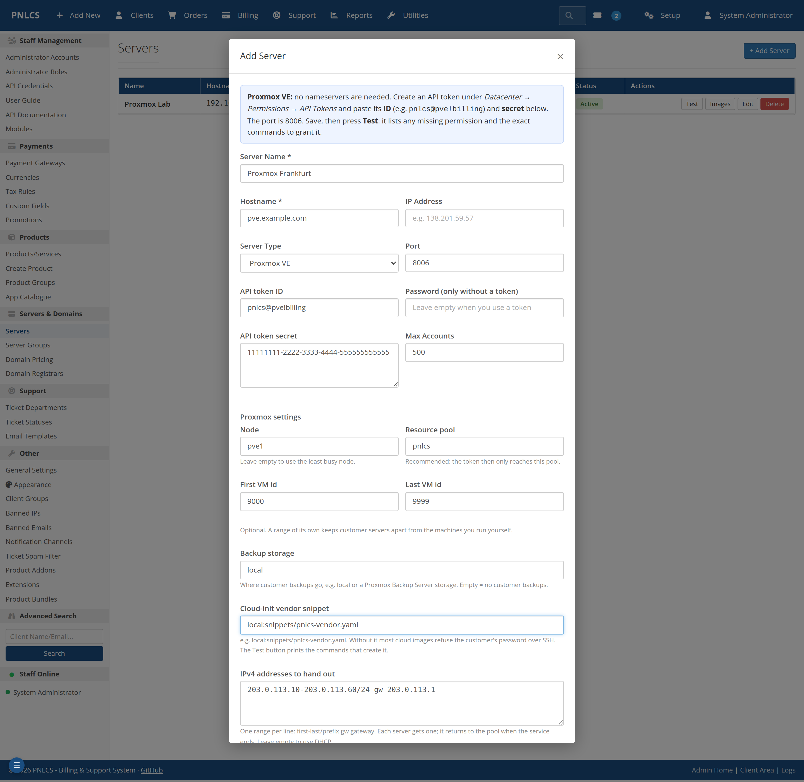
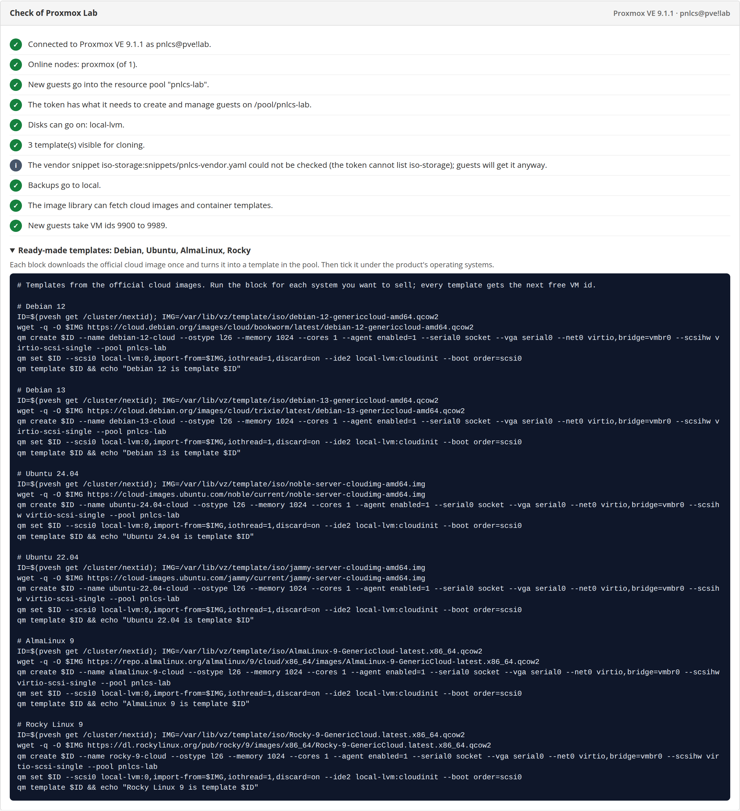

# 2. Connect the server

**Setup → Servers → Add Server**, and choose **Proxmox VE** as the type. The
form hides the nameserver fields (Proxmox needs none) and shows the Proxmox
settings instead.

## The fields

| Field | What to enter |
|-------|---------------|
| **Server Name** | Any name you recognise, e.g. *Proxmox Frankfurt*. Customers see it on their service page |
| **Hostname** | The address of the Proxmox host or of any node in the cluster, e.g. `pve.example.com` |
| **Port** | `8006` (filled in for you) |
| **API token ID** | `pnlcs@pve!billing` — user, realm, `!`, token name |
| **API token secret** | The UUID Proxmox printed once. Pasting the whole `PVEAPIToken=pnlcs@pve!billing=…` line, or the ID and secret side by side as Proxmox shows them, works too |
| **Password** | Only if you sign in with a user and password instead of a token. Leave it empty with a token |
| **Node** | Optional. Empty: each new server goes to the online node with the most free memory |
| **Resource pool** | `pnlcs` — recommended: servers go into it, and the token reaches only it |
| **First / Last VM id** | Optional, e.g. `9000`–`9999`. Customer servers take ids from the bottom of the range, templates made by the image library from the top, and nothing outside it is used |
| **Backup storage** | Where customer backups go, e.g. `local` or a Proxmox Backup Server storage. Empty: no customer backups |
| **Cloud-init vendor snippet** | `local:snippets/pnlcs-vendor.yaml` (see [step 1](prepare-proxmox.md#the-cloud-init-snippet)) |
| **IPv4 addresses to hand out** | Optional ranges, one per line: `203.0.113.10-203.0.113.60/24 gw 203.0.113.1`. Empty: DHCP |
| **Check the Proxmox TLS certificate** | Tick only if the host has a certificate your billing server trusts (Let's Encrypt, for example). The default self-signed certificate would fail |

Save.

## Press Test

**Test** next to the server does much more than check the password. It
reads the token's real permissions where PNLCS will use them and reports,
line by line:

- the Proxmox version and who PNLCS is signed in as;
- a token that signs in but has **no permissions** (privilege separation);
- the nodes that are online, and whether the node you set exists;
- the pool, and whether the token has every right it needs on it — the
  missing ones by name, and what each one switches off;
- rights that are **more than billing needs** (`Sys.Modify`,
  `Permissions.Modify`, …);
- which storages new disks can go on, and whether the token may use a
  bridge (`SDN.Use`, needed since Proxmox 8);
- how many templates the token can see;
- whether the vendor snippet exists, the backup storage accepts backups, and
  the image library may download;
- the VM id range and how many pool addresses are free.

Anything that needs fixing comes with a **"Fix it on the Proxmox host"**
block: the exact `pveum` / `pvesm` commands for your pool, storages and node,
with a **Copy** button. Run them in the host's shell and press Test again.

Under **Ready-made templates** the report also prints shell recipes that turn
the official Debian 12/13, Ubuntu 24.04/22.04, AlmaLinux 9 and Rocky 9 cloud
images into templates — the same thing the image library does from the
admin panel in the next step.

## Several hosts

Add each standalone Proxmox host as its own server. A cluster is one server:
enter the address of any of its nodes. To sell from several servers under one
product, put them in a **server group** (*Setup → Server Groups*) and point the
product at the group.

Next: [install operating systems](operating-systems.md).
