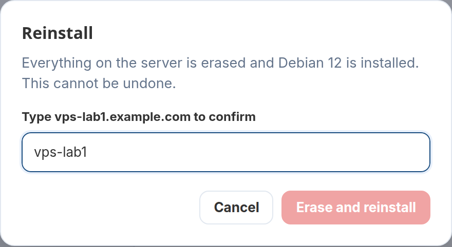

# 5. The customer's panel

A customer opens their service under **Services** and sees the virtual server
panel. The admin's service page shows the same panel
([Running VPS services](running-vps.md#the-admin-panel)).

## State, power and usage

- **State** — running or stopped, the server's name and VM number. While a
  reinstall or restore runs, a blue banner says so and the buttons wait.
- **Start, Reboot, Shut down, Force off, Reset.** *Shut down* asks the system
  to power off and forces it after a minute; *Force off* cuts it at once;
  *Reset* is the machine's reset button, for a server that has hung. Everything
  but *Start* asks first. On a container, *Reset* reboots it.
- **CPU, Memory, Disk, Uptime** — live. The disk shows how full the root
  filesystem is when the QEMU guest agent runs (the vendor snippet installs
  it); without the agent, only the disk's size.
- **IP addresses** (click to copy), **operating system**, **login** and
  **password** (show / copy).

## Graphs

CPU, memory, network in/out and disk read/write, for the last **hour, day,
week, month or year**, read from Proxmox's own statistics. Each graph has
labelled axes, times along the bottom, the current value and the peak, and
shows the exact values under the pointer. A period with no data stays a gap
rather than dropping to zero.

## Snapshots, backups, password, reinstall

| | What happens |
|---|---|
| **Snapshots** | Take a snapshot by name, roll back to it, delete it — up to the number the product allows. Rolling back starts the server again if it was running |
| **Backups** | *Back up now* makes a full copy on the server's backup storage; *Restore* replaces the server with it and removes its snapshots; *Delete*. Up to the number the product allows, and one backup at a time |
| **Reset the root password** | Takes effect at once through the guest agent; without the agent, at the next boot. (Not offered for containers.) |
| **Reinstall** | Erases the server and installs a system from the product's list. The VM number, the MAC address and the IP address stay the same; a new password is set (typed, or generated and shown once) |

Anything that wipes data asks for the server's name first:

## What the customer does not see

The customer is not shown the Proxmox host's name or address, or any other
machine on it. Every request the panel makes is checked against
the service it belongs to; a customer can only reach their own server, and
only while the service is **active** — a suspended customer can still look,
but not switch the server back on.

Next: [running VPS services](running-vps.md).
