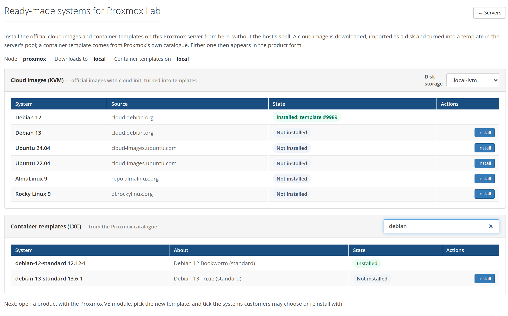

# 3. Install operating systems

A customer's server is a **copy of a template**. PNLCS needs at least one
template before it can sell anything. There are three ways to get them, and
they can be mixed.

## The image library (recommended)

**Setup → Servers → Images** (next to a Proxmox server) lists ready-made
systems and installs them on the host through the API — no shell needed:



**Cloud images (KVM).** The official images of Debian 12, Debian 13,
Ubuntu 24.04, Ubuntu 22.04, AlmaLinux 9 and Rocky Linux 9, straight from
their publishers. **Install** does, on the Proxmox host:

1. downloads the image into the storage that holds *import* content
   (`local`), as `debian-12.qcow2` and so on;
2. creates a machine named `debian-12-cloud` in the server's pool, imports the
   image as its disk on the **Disk storage** chosen at the top, adds a
   cloud-init drive, a serial console and the guest agent;
3. turns it into a template, tagged `pnlcs-image`.

The row shows *Downloading 57%*, *Importing the disk*, *Making the template*
and finally **Installed: template #9999**. You may leave the page: the
scheduler finishes the job. With a VM id range on the server, the template
takes the highest free id in it, so it stays apart from customer servers.
Measured on Proxmox VE 9.1: Debian 12 was downloaded, imported and a
template in about a minute.

**Container templates (LXC).** Proxmox's own appliance catalogue: every
system template for amd64 (Debian, Ubuntu, AlmaLinux, Rocky, Alpine, Fedora,
Arch, …), with a filter. **Install** downloads it into the storage that holds
container templates.

!!! note "Rights"
    The library needs `Datastore.AllocateTemplate` on the download storage
    and `Sys.AccessNetwork` on the node. Without them the page shows a yellow
    box with the three commands that grant them
    ([step 1](prepare-proxmox.md#optional-let-the-admin-panel-install-operating-systems)).

The templates appear in the product form at once, under their friendly
names (*Debian 12*, *Ubuntu 24.04*…).

## The recipes from the Test report

Pressing **Test** on the server prints, under *Ready-made templates*, one
shell block per system. Run a block on the Proxmox host to get the same
template by hand — useful on older Proxmox versions without the *import*
content type, or if you do not want to give the token the library's rights:

```bash
# Debian 12
ID=$(pvesh get /cluster/nextid); IMG=/var/lib/vz/template/iso/debian-12-genericcloud-amd64.qcow2
wget -q -O $IMG https://cloud.debian.org/images/cloud/bookworm/latest/debian-12-genericcloud-amd64.qcow2
qm create $ID --name debian-12-cloud --ostype l26 --memory 1024 --cores 1 --agent enabled=1 --serial0 socket --vga serial0 --net0 virtio,bridge=vmbr0 --scsihw virtio-scsi-single --pool pnlcs
qm set $ID --scsi0 local-lvm:0,import-from=$IMG,iothread=1,discard=on --ide2 local-lvm:cloudinit --boot order=scsi0
qm template $ID && echo "Debian 12 is template $ID"
```

A template made this way carries the same name, so the library shows it as
installed too.

## Your own templates

Any KVM template the token can see works, if it:

- has **cloud-init** installed and a **cloud-init drive** (PNLCS adds the drive
  when it is missing);
- is in the server's **pool** (`pveum pool modify pnlcs --vms <id>`), or
  otherwise visible to the token;
- is on storage the node you sell from can clone from — in a cluster, a
  template on local storage can only be cloned on its own node, so either set
  the node or keep templates on shared storage.

PNLCS sets the root password, the address, the hostname and the disk size
through cloud-init, and grows the disk to the product's size. With the
[vendor snippet](prepare-proxmox.md#the-cloud-init-snippet) the customer can
sign in over SSH with that password.

## Installer ISOs

A KVM product can also boot an **ISO** instead of cloning a template, for a
system without a cloud image. Installing from it needs the machine's screen:
the customer panel has no browser console yet, so today that means you give
the customer console access some other way, or install it for them. PNLCS
cannot set a password or an address inside a system it did not install.

Next: [create the product](create-the-product.md).
