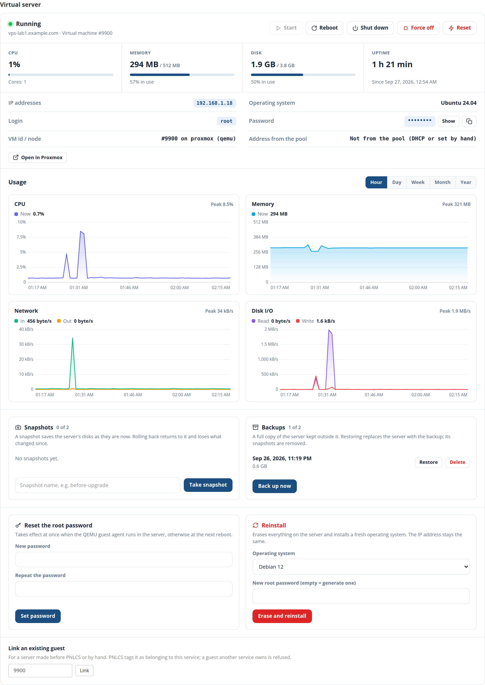
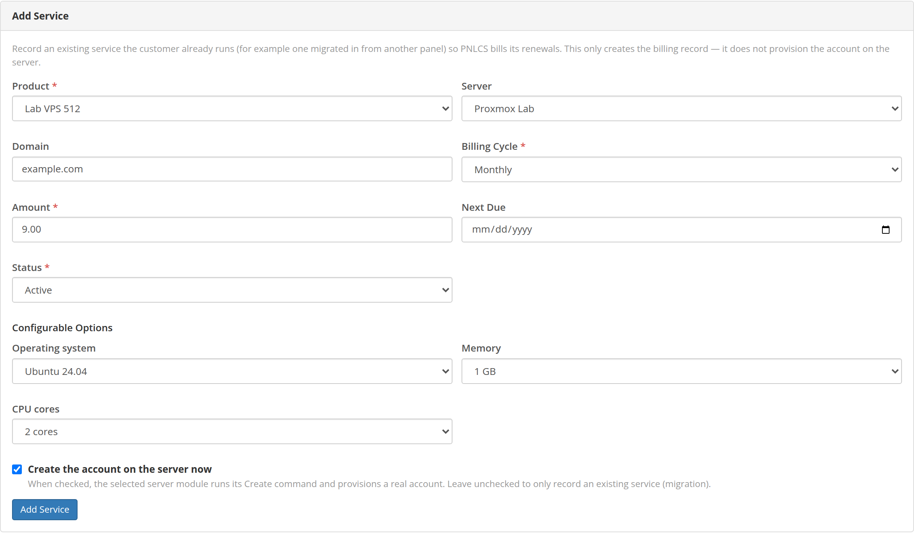

# Running VPS services

## The admin panel

A Proxmox service's page in the admin area (**Clients → a client → Services
→ the service**) has the same panel the customer sees, plus the VM number and
node, the pool address, an **Open in Proxmox** link and a field to link an
existing machine. Staff may also work on a **suspended** service's server — to
look into it, or to take a backup before it is terminated; a terminated or
cancelled one is left alone.

The usual module actions sit above it: **Suspend**, **Unsuspend**,
**Terminate**, **Change Password**.

## Adding a VPS by hand

On a client's **Services** tab, **Add Service**:

- **A new server** — pick the product, the server and the order options
  (operating system, memory, cores…), tick **Create the account on the
  server now**, and PNLCS builds it at once exactly as for an order.
- **A server that already runs** — for a machine made before PNLCS or by
  hand: leave *Create the account…* unticked, pick the server, and choose the
  machine under **Link an existing account**. The list shows what the token
  can see, and names machines another service already has. PNLCS tags the
  chosen machine for the new service and manages it from then on; one that
  belongs to another service is refused.

The same link is on an existing service's page (**Link an existing guest**, by
VM number).

## What happens when

| Event | On Proxmox |
|-------|-----------|
| **Order paid** (or placed / accepted, per *Auto Setup*) | Clone of the template into the pool, with the next VM id in the range; tags and note; cores, memory, network, cloud-init (user, password, address, DNS, vendor snippet); disk grown to the product's size; protection on; started |
| **Suspend** (overdue invoice, or by hand) | *Start at boot* turned off, then shut down (forced after a minute) — a host reboot does not bring it back |
| **Unsuspend** | *Start at boot* on, started |
| **Terminate** | Stopped, protection lifted, deleted with its disks; its pool address goes back to the pool |
| **Upgrade / downgrade** | New cores and memory set (a running KVM takes them at its next reboot); the disk grows if the new size is larger and is never shrunk |
| **Every minute** | The scheduler moves on reinstalls, restores and image downloads |
| **Every hour** | Disk usage and this month's traffic are read into the service |

PNLCS never deletes a machine that does not carry its mark for that service,
and treats a machine that is already gone as removed rather than failing.

## Traffic

Traffic is counted from Proxmox's own statistics for the current calendar
month, so it survives reboots (the counters on the machine itself restart at
every boot). It appears on the service as usage against the product's
monthly traffic.

## Where to look when something went wrong

- **The service page** shows the reason of the last failed job in red.
- **The application log** (`storage/logs/laravel-<date>.log`) has a line for
  every create, suspend, unsuspend, terminate, upgrade, password change and
  link, with the outcome and Proxmox's message.
- **Utilities → Activity Log** records who pressed which button in the VPS
  panel — customer or staff — and whether it worked.
- In Proxmox, the task list (**Datacenter → Tasks**) has the same tasks with
  their full logs.

Next: [troubleshooting and questions](troubleshooting.md).
