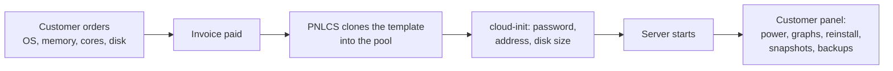

# Sell VPS on Proxmox VE

PNLCS sells **KVM virtual machines** and **LXC containers** on
[Proxmox VE](https://www.proxmox.com/en/proxmox-virtual-environment). When an
order is paid, the server is built from a template, sized, given an address
and started — and the customer then runs it from the billing portal: power,
live graphs, root password, reinstall, snapshots and backups. You see the same
panel on the admin's service page.

The module was tested end to end against a live **Proxmox VE 9.1** host,
through an API token that can reach only its own resource pool: templates
installed from the admin panel, servers created from orders and by hand,
reinstalled, snapshotted, backed up and restored, and signed into over SSH with
the password PNLCS set.

## How it fits together

Every server PNLCS makes carries a **tag and a note naming its service**.
PNLCS stops, reinstalls or deletes a machine only when that mark is there —
a VM id in the billing records is never enough on its own — so the machines
you run on the same host for other reasons are never touched.

## Setting it up, step by step

| Step | What you do | Where | Time |
|------|-------------|-------|------|
| 1 | [Prepare Proxmox](proxmox/prepare-proxmox.md): a pool, a user, an API token and its permissions, the cloud-init snippet | Proxmox host shell | ~10 min, once |
| 2 | [Connect the server](proxmox/connect-the-server.md) and press **Test** | PNLCS → Setup → Servers | 2 min |
| 3 | [Install operating systems](proxmox/operating-systems.md) from the image library | PNLCS → Servers → Images | 1 min per system |
| 4 | [Create the product](proxmox/create-the-product.md): resources, network, allowances, checkout options | PNLCS → Products | 5 min |
| 5 | Order it yourself once and check the [customer's panel](proxmox/customer-panel.md) | Client area | 2 min |

After that: [running VPS services](proxmox/running-vps.md) (adding one by
hand, suspending, upgrading, traffic) and
[troubleshooting and questions](proxmox/troubleshooting.md).

## What you need

- **Proxmox VE 8 or 9** (7.x works but is not tested; the check warns below 7).
  A single node or a cluster.
- **A storage for disks** (`local-lvm`, ZFS, Ceph…) and **a network bridge**
  the servers go on (usually `vmbr0`).
- **A way to give addresses**: DHCP on the bridge, or a range of public IPv4
  addresses PNLCS hands out one per server.
- **The PNLCS scheduler** running every minute
  ([cron runner](../install/native.md#13-schedule-the-cron-runner)): it
  finishes long jobs such as reinstalls and image downloads.

No nameservers are needed for Proxmox.
