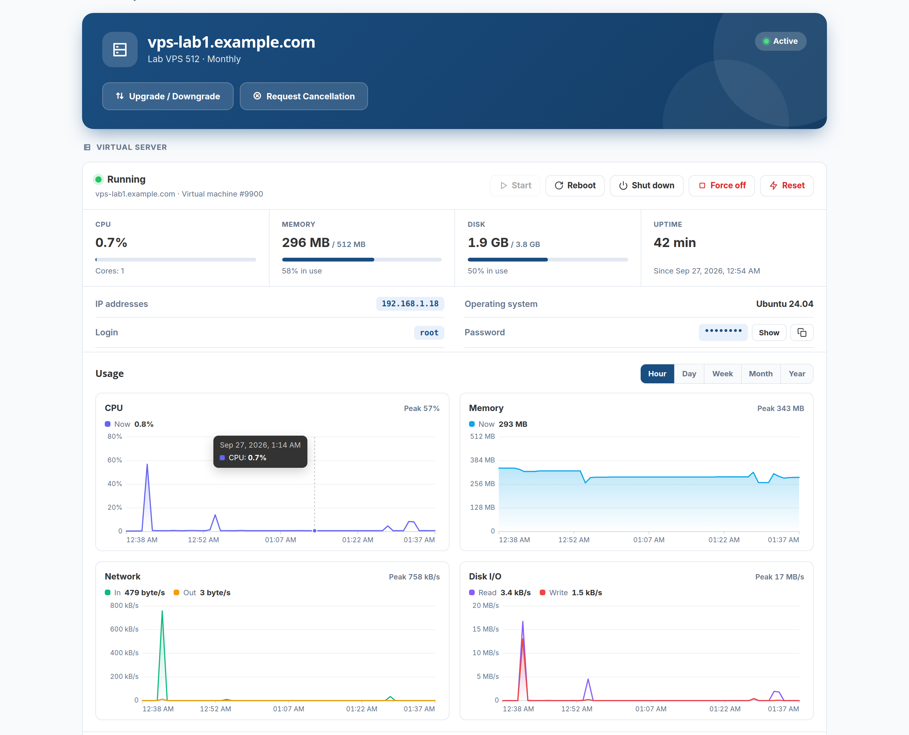
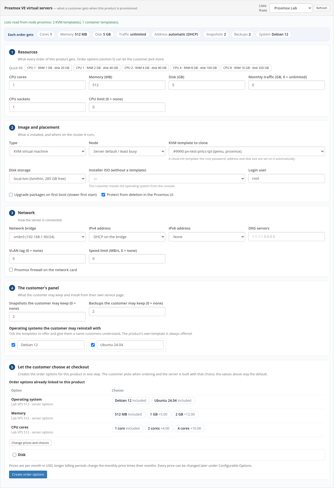
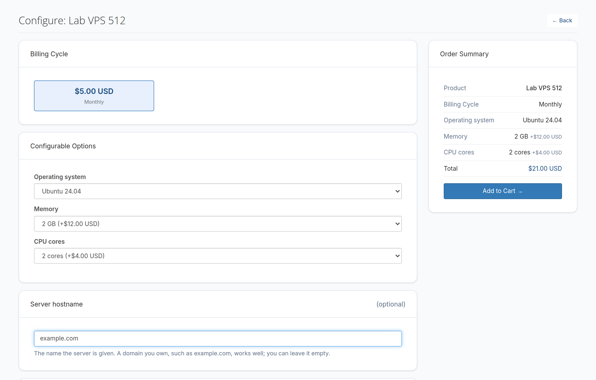
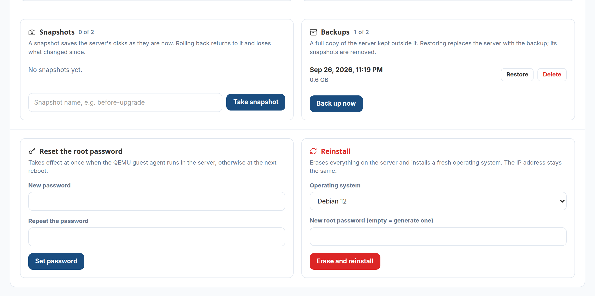

# Sell VPS on Proxmox VE

PNLCS sells KVM virtual machines and LXC containers on Proxmox VE. When an
order is paid, the server is cloned from a cloud-init template, sized, given an
address and started. The customer then runs it from the billing portal, and
you see the same panel on the admin's service page.



## 1. Create an API token

In Proxmox, open **Datacenter → Permissions → API Tokens** and add a token.

!!! warning "Privilege separation"
    With *Privilege Separation* ticked, the token has only the permissions
    given to the token itself. A token made that way and nothing else signs in
    but can do nothing. The **Test** button in PNLCS spots this and prints the
    commands that fix it.

The safest set-up is a user and token of their own, limited to one resource
pool. The Test button prints exactly that:

```bash
pveum role add PNLCS --privs "VM.Allocate VM.Clone VM.Audit VM.PowerMgmt ..."
pveum pool add pnlcs --comment "Guests sold through PNLCS"
pveum user add pnlcs@pve --comment "PNLCS billing"
pveum user token add pnlcs@pve billing --privsep 0 --comment "PNLCS"
pveum acl modify /pool/pnlcs --users pnlcs@pve --roles PNLCS
```

The printed version carries the full list of privileges and the storage,
bridge and node permissions for your cluster.

## 2. Add the server

**Setup → Servers → Add Server**, type **Proxmox VE**:

| Field | What to enter |
|-------|---------------|
| Hostname | The Proxmox host or cluster address |
| Port | 8006 |
| API token ID | e.g. `pnlcs@pve!billing` |
| API token secret | The secret Proxmox showed once |
| Node | Optional; empty uses the least busy node |
| Resource pool | Recommended: the token then reaches only this pool |
| VM id range | Optional; keeps customer servers apart from your own machines |
| IPv4 addresses | Optional; one range per line, `first-last/prefix gw gateway`. Empty uses DHCP |
| Backup storage | Where customer backups go, e.g. `local` or a Proxmox Backup Server storage |
| Cloud-init vendor snippet | e.g. `local:snippets/pnlcs-vendor.yaml` |

No nameservers are needed for Proxmox.

!!! tip "Why the vendor snippet"
    The official Debian and Ubuntu cloud images refuse password logins over
    SSH. The snippet turns password login on and installs the QEMU guest agent,
    so the customer can sign in with the password PNLCS gives them, and a new
    password takes effect at once. The Test button prints the commands that
    create it.

## 3. Press Test

The check reads the Proxmox version, the token's real permissions (and what is
more than billing needs), the pool, storages, bridges, templates, the snippet
and the backup storage. Whatever needs fixing comes with the commands to run on
the Proxmox host, plus recipes that turn the official Debian 12/13, Ubuntu
24.04/22.04, AlmaLinux 9 and Rocky 9 cloud images into templates.

## 4. Create the product

Create a product with the **Proxmox VE** server module. Its card has five parts:



1. **Resources** — cores, memory, disk and monthly traffic, with quick-fill sizes.
2. **Image and placement** — KVM or LXC, node, the template to clone (read live
   from the cluster), disk storage, login user.
3. **Network** — bridge, IPv4 by DHCP or from the server's pool, IPv6, DNS
   servers, VLAN and speed limit.
4. **The customer's panel** — how many snapshots and backups the customer may
   keep, and the operating systems they may reinstall with.
5. **Let the customer choose at checkout** — builds the order options
   (operating system, memory, cores, disk) with their monthly prices in one
   step. Longer billing periods charge the monthly price times their months;
   every price can be changed later under Configurable Options.

The values in parts 1–4 are the default an order gets; a choice made at
checkout replaces them.



## 5. What the customer can do

| Area | What happens |
|------|--------------|
| Power | Start, reboot, shut down, force off, reset |
| Live status | CPU, memory, uptime, addresses; how full the root filesystem is when the guest agent runs |
| Graphs | CPU, memory, network and disk I/O for the last hour, day, week, month or year |
| Root password | At once through the guest agent, otherwise at the next boot |
| Reinstall | An operating system the product offers; the VM id, MAC and address stay |
| Snapshots | Take, roll back, delete — up to the plan's number |
| Backups | Back up, restore, delete — up to the plan's number |

A reinstall or a restore asks the customer to type the server's name first.
These long jobs are finished by the scheduler every minute, so keep the
[cron runner](../install/native.md#13-schedule-the-cron-runner) in place.



## Adding a VPS by hand

On a client's **Services** tab, **Add service**: choose the product and its
options and tick *Provision now* to build it. To bring in a server that
already runs, leave provisioning off and pick it from **Link an existing
account** — PNLCS tags it for the new service.

## What PNLCS will not do

- Stop, reinstall or delete a machine that does not carry its mark for the
  service. A VM id in the billing records is never enough on its own.
- Leave a suspended server set to start at boot.
- Show the customer the hypervisor's address.
