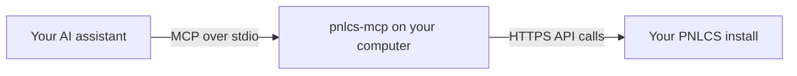

# MCP server

`pnlcs-mcp` connects an AI assistant to your PNLCS install through the
[Model Context Protocol](https://modelcontextprotocol.io). Once it is set up
you can ask your editor or assistant things like:

- *"Which invoices are overdue, and who owes the most?"*
- *"Show me this client's services and domains."*
- *"Were any orders held as fraud today?"*
- *"Open a ticket for ada@example.com about her domain renewal."*

The assistant answers by calling the PNLCS [API](../api/index.md) with a
credential you create, so it can see and do exactly what that credential's
staff account can, and nothing more.

| At a glance | |
|---|---|
| Package | [`pnlcs-mcp` on npm](https://www.npmjs.com/package/pnlcs-mcp) |
| Source | [`mcp/` in the PNLCS repository](https://github.com/Panelica/pnlcs/tree/main/mcp) |
| Needs | Node.js 18 or newer on the computer where the assistant runs |
| Transport | stdio: the assistant starts the server itself; there is no port to open and nothing to host |
| Dependencies | None |
| Tools | 15 that read, and 7 that change something (off unless you allow them). See [MCP tools](tools.md). |

## How it works



The server runs on your computer, next to the assistant. It sends ordinary API
requests to your PNLCS install, over HTTPS, with the credential in the request
headers. Nothing is installed on the PNLCS side. The credential never leaves
your computer except to reach your own PNLCS install; the model only sees
what the tools return.

## 1. Create a credential for the assistant

1. In the PNLCS admin area, create a staff account for the assistant
   (**Setup → Admin Accounts**) and give it a role (**Setup → Admin Roles**) with only what the
   assistant should be able to do. For read-only reporting, the list and view
   permissions are enough.
2. Signed in as that account, open **Setup → API Credentials** and click
   **Generate API Key**. Name it, for example `mcp`.
3. Copy the **identifier** and the **secret**. The secret is shown once.
4. Optional but recommended: **Edit** the credential and put the address of
   the computer running the assistant in **Allowed IP addresses**.

The credential answers with its staff account's permissions. A tool that
account may not use answers *Your account does not have permission for this
action.* Disabling the staff account stops the credential at once.

## 2. Configure your assistant

The server reads four environment variables:

| Variable | Value |
|---|---|
| `PNLCS_URL` | Your PNLCS address, for example `https://billing.example.com` |
| `PNLCS_IDENTIFIER` | The credential identifier |
| `PNLCS_SECRET` | The credential secret |
| `PNLCS_ALLOW_WRITES` | Optional. `1` also offers the tools that change something |

Most MCP clients read the same configuration block. Put it where your client
keeps its MCP servers:

```json
{
  "mcpServers": {
    "pnlcs": {
      "command": "npx",
      "args": ["-y", "pnlcs-mcp"],
      "env": {
        "PNLCS_URL": "https://billing.example.com",
        "PNLCS_IDENTIFIER": "your_identifier",
        "PNLCS_SECRET": "your_secret"
      }
    }
  }
}
```

Restart the client after changing its configuration.

=== "Cursor"

    **Settings → MCP → Add new global MCP server**, and paste the block above.
    For a single project, save it as `.cursor/mcp.json` in the project.

=== "VS Code"

    Create `.vscode/mcp.json` in your workspace:

    ```json
    {
      "servers": {
        "pnlcs": {
          "type": "stdio",
          "command": "npx",
          "args": ["-y", "pnlcs-mcp"],
          "env": {
            "PNLCS_URL": "https://billing.example.com",
            "PNLCS_IDENTIFIER": "your_identifier",
            "PNLCS_SECRET": "your_secret"
          }
        }
      }
    }
    ```

    The tools are then available in the chat's agent mode.

=== "Windsurf, Cline, Zed and others"

    Any client that can start a stdio MCP server needs the same three things:
    the command `npx`, the arguments `-y pnlcs-mcp`, and the environment
    variables above. See your client's documentation for where they go.

=== "From a checkout"

    Instead of `npx`, run the server from a clone of the repository:
    command `node`, argument `/path/to/pnlcs/mcp/server.js`, same variables.

!!! warning "Keep the secret out of shared files"
    If the configuration file is committed to a repository or shared, do not
    write the secret into it. Most clients can take `env` values from your
    shell environment instead.

## 3. Check that it works

Ask the assistant *"What are my PNLCS stats?"*. It should call `get_stats`
and answer with the number of clients, invoices, orders and tickets. If it
cannot find the tool, see [Troubleshooting](#troubleshooting).

## Read-only or read-write

By default only the 15 read tools are offered. With `PNLCS_ALLOW_WRITES=1`
seven more appear: create a client, create an invoice, record a payment, open
a ticket, reply to a ticket, suspend and unsuspend a service.

Without the variable the write tools are not only hidden: a call to one is
refused before anything reaches PNLCS. The staff account's role still applies
on top of that: a write tool whose permission the account lacks is refused by
PNLCS.

Review what the assistant proposes before approving a tool call that creates
or changes something. `suspend_service` suspends the account on its server.

The full list, with every argument, is on the [MCP tools](tools.md) page.

## Security

- Give the assistant its own staff account, role and credential, so you can
  limit it and revoke it on its own.
- Restrict the credential to the address the assistant runs from.
- The credential travels in the `X-API-Key` and `X-API-Secret` headers, over
  HTTPS, never in the URL.
- PNLCS allows each credential 300 requests a minute, so a runaway assistant
  cannot flood your install.
- Everything the assistant does is recorded in the activity log under its
  staff account's name.

!!! danger "Using version 1.0.4 or older?"
    Versions up to 1.0.4 sent the identifier and secret in the query string of
    every read, where web servers and proxies log them. Update, then create a
    new credential and delete the old one.

## Troubleshooting

| Symptom | Cause and fix |
|---|---|
| Every tool answers `Set PNLCS_URL, PNLCS_IDENTIFIER and PNLCS_SECRET.` | One of the variables is missing from the client's configuration. |
| Every tool answers `Invalid API secret` | The secret does not belong to that identifier. |
| Every tool answers `Authentication required...` | PNLCS knows no active credential with that identifier: it is mistyped, switched off or deleted. |
| `IP address not allowed for this credential` | The credential has an allow-list that does not include this computer's address. |
| `PNLCS did not answer within 30 seconds` | The install cannot be reached from this computer: check the address and any firewall. |
| The tools do not appear | Restart the client after editing its configuration, and read its MCP log. |
| The write tools do not appear | That is the default: set `PNLCS_ALLOW_WRITES=1`. |
| `Your account does not have permission for this action.` | The staff account's role lacks the permission for that tool. |
| `The account this credential belongs to is disabled.` | The staff account was disabled; use a credential of an active account. |

## Testing the server

From the `mcp/` directory of the repository:

- `npm test` runs the offline tests: it starts the real server, speaks the
  protocol to it and checks every tool's request against a local stand-in for
  PNLCS.
- `node test/live.mjs` runs every tool against a real install. It creates
  clearly named test records for the write tools, so point it at a test
  install, never at your real books.
